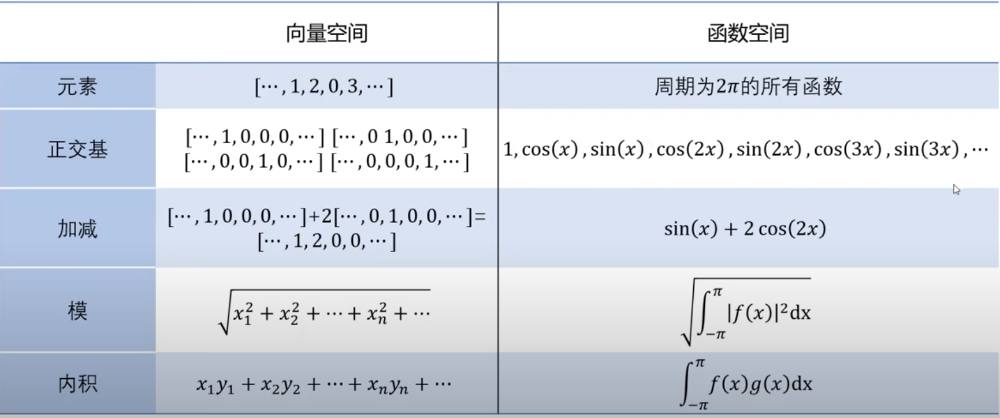
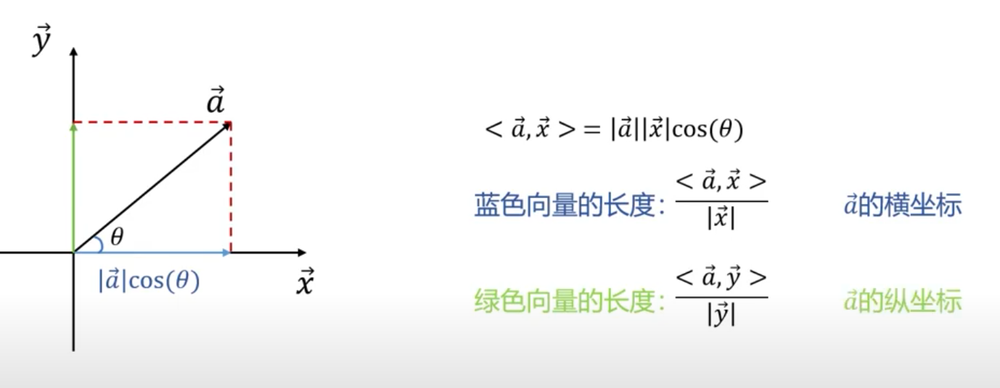
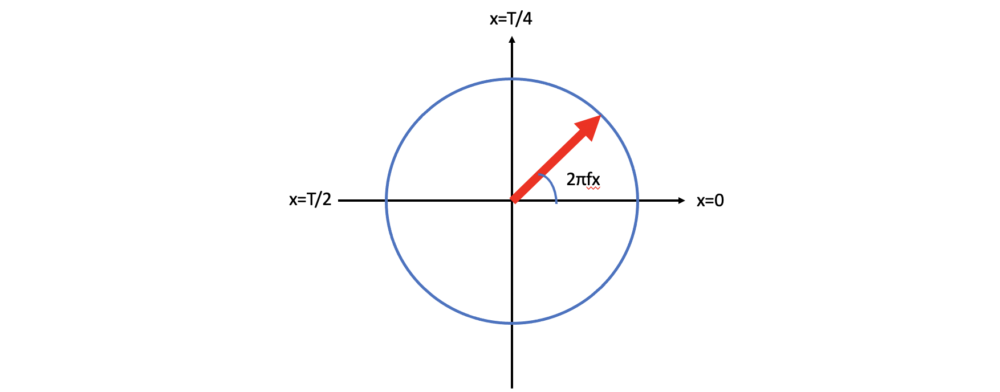
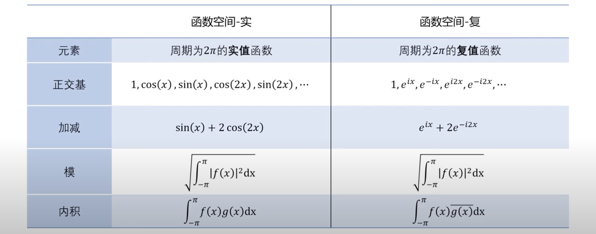
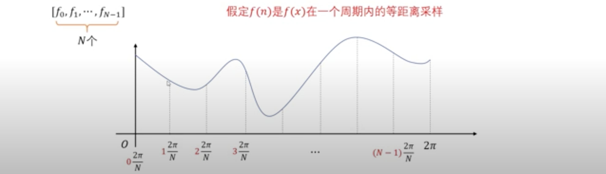
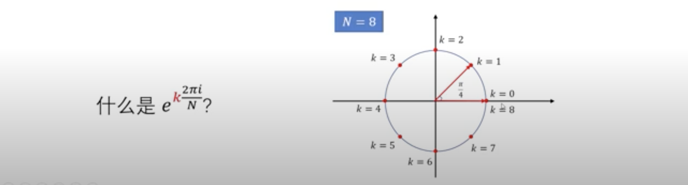
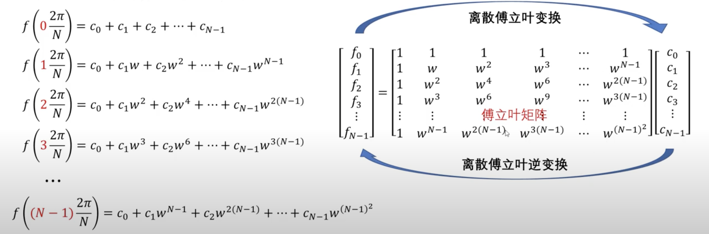

用此篇博客送别2020年，迎接2021（做了个阑尾手术继续写）

学习GCN的时候，spectual method的理论基础就是图上的傅立叶变换，图傅立叶变换又是传统傅立叶变换的一种变形，所以学会GCN势必要学会傅立叶变换。一言以蔽之，傅立叶变换就是从时域到频域的变换。本文基于参考资料1整理。

# 傅立叶级数

如果函数$F(x)$是周期函数，那么$F(x)$可以展开成以正弦和余弦为基的线性组合，任意周期的函数都可以展开成傅立叶级数。($w=\frac{2\pi}{T}=2\pi f$)
$$
\begin{array}{rl}
F(x) & = \sum\limits_{n=0}^\infty\bigg[a_n\cos\big(\frac{2n\pi}{T}x\big) + b_n\sin\big(\frac{2n\pi}{T}x\big)\bigg]\\
& = a_0 + \sum\limits_{n=1}^\infty\bigg[a_n\cos\big(\frac{2n\pi}{T}x\big) + b_n\sin\big(\frac{2n\pi}{T}x\big)\bigg]\\
& = a_0 + \sum\limits_{n=1}^\infty\bigg[a_n\cos\big(2\pi fnx\big) + b_n\sin\big(2\pi fnx\big)\bigg]
\end{array}
$$

## 应该使用哪些频率（周期）的三角函数的线性组合来组成$F(x)$？

$\cos(2\pi f\cdot x)$, $\sin(2\pi f\cdot x)$, $\cos(2\pi f\cdot2x)$, $\sin(2\pi f\cdot2x)$, ..., $\cos(2\pi f\cdot nx)$, $\sin(2\pi f\cdot nx)$, $\cos(0x)$ 这些三角函数的周期都是T，所以可以选为基。相反周期不是T的三角函数就不能选做基。

## sin和cos都需要？

> 任何一个函数都可以表示成一个奇函数和一个偶函数的和。$F(x) = \frac{F(x)+F(-x)}{2}+\frac{F(x)-F(-x)}{2}$

sin是奇函数，cos是偶函数，所以两种三角函数都需要。

## 如何计算$a_n$和$b_n$？

现在我们已经知道周期为T的函数$F(x) = a_0+\sum\limits_{n=1}^\infty(a_n\cos(2\pi fnx)+b_n\sin(2\pi fnx))$，下面考虑如何求出每一项三角函数前面的系数。这里使用积分来求系数，具体原因下节再说。通常$F(x)$是有表达式的，能求积分，只是还不知道如何用三角函数表示而已。因为$F(x)$的周期为T，所以$F(x) = F(x+T)$. 
$$
\begin{array}{ll}
\int_{-T/2}^{T/2}F(x)dx = \int_{-T/2}^{T/2}a_0dx = a_0T & \Rightarrow a_0=\frac{1}{T}\int_{-T/2}^{T/2}F(x)dx\\
\int_{-T/2}^{T/2}F(x)\cos(2\pi fx)dx = a_1\int_{-T/2}^{T/2}\cos(2\pi fx)\cdot\cos(2\pi fx)dx = a_1\frac{T}{2} & \Rightarrow a_1 = \frac{2}{T}\int_{-T/2}^{T/2}F(x)\cos(2\pi fx)dx\\
\int_{-T/2}^{T/2}F(x)\sin(2\pi fx)dx = b_1\int_{-T/2}^{T/2}\sin(2\pi fx)\cdot\sin(2\pi fx)dx = b_1\frac{T}{2} & \Rightarrow b_1 = \frac{2}{T}\int_{-T/2}^{T/2}F(x)\sin(2\pi fx)dx\\
...
\end{array}
$$
可以发现，$F(x)$与三角函数的积分，可以被很大程度的化简，例如上面求$a_1$和$b_1$的两式。经过傅立叶级数展开后，不同三角函数乘积的积分都为0（$\int_{-\pi}^{\pi}\cos(Ax)\cdot\cos(Bx)dx=0$，$\int_{-\pi}^{\pi}\cos(Ax)\cdot\sin(Cx)dx=0$，其中$A\neq B, C\in N^+$）。这是为什么呢？因为三角函数的正交性。

# 三角函数正交性

上一小节告诉我们，要求出系数$a_n, b_n$需要求解以下几种积分：

- $\int_{-T/2}^{T/2}a_0\cos(2\pi fnx)dx$=0，
- $\int_{-T/2}^{T/2}a_0\sin(2\pi fnx)dx$=0，
- $\int_{-T/2}^{T/2}\cos(2\pi fmx)\cos(2\pi fnx)dx$，
- $\int_{-T/2}^{T/2}\sin(2\pi fmx)\cos(2\pi fnx)dx$，
- $\int_{-T/2}^{T/2}\sin(2\pi fmx)\sin(2\pi fnx)dx$，

前2种积分比较简单，因为$\cos(2\pi fnx)$和$\sin(2\pi fnx)$的周期都是T，所以这两种积分都为0. 后面三种积分需要计算一下（积化和差公式）：
$$
\begin{array}{ll}
\int_{-T/2}^{T/2}\cos(2\pi fmx)\cos(2\pi fnx)dx = \frac{1}{2}\int_{-T/2}^{T/2}\cos[2\pi f(m+n)x]+\cos[2\pi f(m-n)x]dx=\begin{cases} T & n=m=0\\0 & n\neq m\\ T/2 & n=m\neq 0
\end{cases}\\
\int_{-T/2}^{T/2}\sin(2\pi fmx)\cos(2\pi fnx)dx = \frac{1}{2}\int_{-T/2}^{T/2}\sin[2\pi f(m+n)x]+\sin[2\pi f(m-n)x]dx=0\\
\int_{-T/2}^{T/2}\sin(2\pi fmx)\sin(2\pi fnx)dx = -\frac{1}{2}\int_{-T/2}^{T/2}\cos[2\pi f(m+n)x]-\cos[2\pi f(m-n)x]dx=\begin{cases} 0 & n\neq m\text{或}n=m=0\\ T/2 & n=m\neq 0
\end{cases}
\end{array}
$$
正交性成立的条件：

- T是$\cos(2\pi fnx)$，$\sin(2\pi fnx)$的周期
- 积分区间的长度为T（不一定是$[-T/2, T/2]$）

## 正交基和函数空间

正交基：跟自己作内积不为0；跟其他作内积为0. 

向量空间：一组基所有可能的线性组合得到的向量集合。

函数空间：一组函数基所有可能的线性组合得到的函数集合。

函数空间可以是无穷维：1，$\cos(2\pi fx)$， $\cos(2\pi f\cdot 2x)$，...，$\cos(2\pi f\cdot nx)$，...，$\sin(2\pi fx)$，$\sin(2\pi f\cdot 2x)$，...，$\sin(2\pi f\cdot nx)$，...

根据傅立叶级数的定义，这些三角函数的线性组合，就是周期为T的函数$F(x)$。

## 投影与坐标

x和y是向量空间的一组基，向量a可以写成x和y的线性组合。

函数空间上，由三角函数构成的一组基（正交但不标准）：例如，周期为T的函数$F(x)$在基函数$\cos(2\pi f\cdot nx)$方向上的投影长度为
$$
\frac{<F(x), \cos(2\pi f\cdot nx)>}{|\cos(2\pi f\cdot nx)|}=\frac{\int_{-T/2}^{T/2}F(x)\cos(2\pi f\cdot nx)dx}{\sqrt{\int_{-T/2}^{T/2}\cos^2(2\pi f\cdot nx)dx}}=\frac{1}{\sqrt{T/2}}\int_{-T/2}^{T/2}F(x)\cos(2\pi f\cdot nx)dx
$$
这个跟上一节的$a_n$的结果不一致，这是因为投影得到的值是关于标准正交基的长度，标准正交基应该是$\cos(2\pi f\cdot nx)/\sqrt{T/2}$

$F(x)$在$\cos(2\pi f\cdot nx)$方向上的投影相对于基$\cos(2\pi f\cdot nx)$的长度：
$$
\frac{<F(x), \cos(2\pi f\cdot nx)>}{|\cos(2\pi f\cdot nx)|^2}=\frac{1}{T/2}\int_{-T/2}^{T/2}F(x)\cos(2\pi f\cdot nx)dx=a_n
$$
综上，傅立叶级数的系数，就是F(x)在基$\cos(2\pi f\cdot nx)$或$\sin(2\pi f\cdot nx)$等方向上基于这个基的投影长度。

# 傅立叶级数的复数形式

前面得到的是傅立叶级数的实数形式，下面来推导出傅立叶级数的复数形式。为什么要推导出复数形式，具体原因也不知道，傅立叶级数在最开始也是实数形式，后来出现电磁波理论就得到了复数形式，可能是科学的发展和进步吧。不过复数形式确实简洁优雅很多。而且实数形式是复数形式的特例。傅立叶级数的复数形式后面方便于离散傅立叶变换的推导。
$$
\begin{array}{rl}
F(x) = & a_0 + \sum\limits_{n=1}^\infty a_n\cos(2\pi fnx)dx + \sum\limits_{n=1}^\infty b_n\sin(2\pi fnx)dx\\
& (\cos\theta = \frac{e^{i\theta}+e^{-i\theta}}{2}, \sin\theta=\frac{e^{i\theta}-e^{-i\theta}}{2i})\\
= & a_0 + \sum\limits_{n=1}^\infty\frac{a_n}{2}(e^{2\pi ifnx}+e^{-2\pi ifnx}) + \sum\limits_{n=1}^\infty\frac{b_n}{2i}(e^{2\pi ifnx}-e^{-2\pi ifnx})\\
= & a_0 + \sum\limits_{n=1}^\infty\big(\frac{a_n-ib_n}{2}\big)e^{2\pi ifnx} + \sum\limits_{n=1}^\infty\big(\frac{a_n+ib_n}{2}\big)e^{-2\pi ifnx}\\
& (c_n = \frac{a_n-ib_n}{2}, c_{-n}=\frac{a_n+ib_n}{2}(n\ge 1), c_0=a_0)\\
= & \sum\limits_{n=-\infty}^\infty c_ne^{2\pi ifnx}
\end{array}
$$

## 如何求$c_n$

我们肯定不想通过求$a_n,b_n$来求$c_n$，所以该如何求$c_n$呢？就顺着$a_n, b_n$来求$c_n$的表达式。
$$
\begin{array}{rl}
c_n&=\frac{a_n-ib_n}{2}=\frac{\frac{2}{T}\int_{-T/2}^{T/2}F(x)\cos(2\pi fnx)dx-i\frac{2}{T}\int_{-T/2}^{T/2}F(x)\sin(2\pi fnx)dx}{2}\\
&=\frac{1}{T}\bigg(\int_{-T/2}^{T/2}F(x)\cos(2\pi fnx)dx -i\int_{-T/2}^{T/2}F(x)\sin(2\pi fnx)dx\bigg)\\
&=\frac{1}{T}\int_{-T/2}^{T/2}F(x)\big[\cos(2\pi fnx)-i\sin(2\pi fnx)\big]dx\\
&=\frac{1}{T}\int_{-T/2}^{T/2}F(x)e^{-2\pi ifnx}dx ~~~(n\ge 1)
\end{array}
$$
另外，

$$
\begin{array}{l}
c_{-n}=\frac{1}{T}\int_{-T/2}^{T/2}F(x)e^{2\pi ifnx},~~~(n\ge 1)\Rightarrow c_n=\frac{1}{T}\int_{-T/2}^{T/2}F(x)e^{-2\pi ifnx}dx,~~~(n\le 1)\\
c_0=\frac{1}{T}\int_{-T/2}^{T/2}F(x)dx
\end{array}
$$

综合上面这三个式子可得：$c_n=\frac{1}{T}\int_{-T/2}^{T/2}F(x)e^{-2\pi ifnx}dx, ~~~(n\in N)$.

## 复数形式的基
复数基是$e^{2\pi ifnx}$，是关于x的函数，看不同的n，对应不同的函数：

- $n=0$：$f(x)=e^0=1$

- $n=1$：$f(x) = e^{2\pi ifx}$，在复平面上看这个函数长什么样子：首先这个函数的模为1，所以函数在一个复平面的单位圆上，俯角是$2\pi fx$. 当$x=0$时，俯角是0；当$x=T$时，俯角又回到了0，所以这个函数的最小正周期是T

  

- $n=2$：$f(x)=e^{2\pi if\cdot 2x}$，这个函数的模是1，跟上一个函数一样是复平面上的单位圆；但是函数的最小正周期变成了T/2
- $n=-1$：$f(x)=e^{-2\pi ifx}$，这个函数的模是1，但x增大时，单位圆是顺时针旋转，最小正周期是T

所以$F(x)=\dots+c_{-2}e^{-2\pi if\cdot 2x}+c_{-1}e^{-2\pi ifx}+c_0+c_1e^{2\pi ifx}+c_2e^{2\pi if\cdot 2x}+\dots$可以表示成很多个基函数的加权和。

## 复数基的正交性

证明复数基的正交性，跟三角函数正交性的方法类似，复数函数正交性也需要定一个内积，同样还是定义积分来求解内积。很遗憾$\int_{-T/2}^{T/2}e^{2\pi ifnx}e^{2\pi ifmx}dx$不能作为复数基的内积，因为不能保证自己跟自己的内积一定是正数。有一种定义方式可以保证自己跟自己的内积一定是正数，即**共轭**
$$
\int_{-T/2}^{T/2}e^{2\pi ifmx}e^{-2\pi ifnx}dx=\int_{-T/2}^{T/2}e^{2\pi i(m-n)x}dx=
\begin{cases}
0, ~~~m\neq n\\
T, ~~~m=n
\end{cases}
$$
下图是三角函数基和复数基的比较，但下图的周期简化为了$2\pi$，所以看起来形式简单：

复数标准正交基：$e^{2\pi ifnx}/\sqrt{T}$，这是因为上面的复数基还不是标准正交基，所以要除以复数空间上的模，即T。注意，这里是复数空间上的模，并不是函数的模（函数模为1），不要搞混了。

# 傅立叶变换

一个周期为T的函数可以展开成傅立叶级数的复数形式$F(x)=\sum\limits_{n=-\infty}^\infty c_ne^{2\pi ifnx}$，$F(x)$的傅立叶变换就是把$F(x)$写成$c_n$的向量：
$$
F(x) ~~~\Rightarrow ~~~ [\dots,c_{-k},c_{-k+1},\dots,c_{-2},c_{-1},c_0,c_1,c_2,\dots,c_{k-1},c_{k},\dots]
$$
即用一串频域信号来表示时域信号。

周期为T的函数一定可以表示成傅立叶级数的复数形式，只是不知道级数（**不同的基函数**）前面的系数$c_n$是多少。所以傅立叶变换也可以写成：$c_n=g(n)=\sum\limits_{t=-\infty}^\infty F(t)e^{-2\pi ifnt}$. 但如果把$e^{-2\pi i(fn)t}$里面的$(f*n)$看成一个整体$\hat{f}$，就可以得到不同的频率（$f$的倍数）对应的频域信号大小：$g(\hat{f}) =\sum\limits_{t=-\infty}^\infty F(t)e^{-2\pi i\hat{f}t}= \int_{-\infty}^\infty F(t)e^{-2\pi i \hat{f}t}dt$.

不同的基函数$e^{2\pi ifnx}$对应的频率不同（回想单位圆的最小正周期），如果$F(x)$在某个频率上的系数$c_k$值特别大，说明这个函数主要由频率为$kf$的基函数$e^{2\pi ifkx}$构成。一个时域上的周期函数，可以转化为频域上的信号（频谱）；如果函数的周期为T，那么通过傅立叶变换，可以完全的用傅立叶级数来表示。

## 周期对于频谱的影响

虽然任何一个周期函数的傅立叶变换都可以写成无穷个$c_n$的形式，但是不同周期的函数对应的频谱并不一样。

假设有个周期为T的函数$F_1(x)$和一个周期为2T的函数$F_2(x)$，如果把这两个函数的频谱放在同一个坐标上，可以发现$F_2(x)$的谱线的密度比$F_1(x)$的谱线更加密。这是因为$F_1(x)$和$F_2(x)$基函数对应的频率分别为$k/T$和$k/2T$，$F_2(x)$谱线的间距为$1/2T$，比$F_1(x)$的间距小。

综上，周期越大，频谱谱线越密。

## 非周期函数

傅立叶级数对应的是周期信号，而傅立叶变换则对应的是一个时间连续可积信号（不一定是周期信号）。

假定周期T逐渐变大，则谱线间间隔将逐渐变小，如果周期T无限放大，变成无穷大，则信号或者函数就变成非周期信号或函数了，此时谱线就变成连续的了，而非一根一根离散的谱线！

非周期函数无法完全用傅立叶级数来表示了，原本傅立叶级数的n是整数，对于非周期函数就多加一些非整数的频率进去，所以频谱不再是离散整数的，而是连续的了。

## 傅立叶逆变换

傅立叶变换$g(\hat{f}) =\sum\limits_{t=-\infty}^\infty F(t)e^{-2\pi i\hat{f}t}= \int_{-\infty}^\infty F(t)e^{-2\pi i \hat{f}t}$是把时域信号$F(t)$变成频域信号$g(\hat{f})$。

反过来，傅立叶逆变换是$F(t) = \sum\limits_{\hat{f}=-\infty}^\infty g(\hat{f})e^{2\pi i\hat{f}t}=\int_{-\infty}^\infty g(\hat{f})e^{2\pi i\hat{f}t}d\hat{f}$，用频域信号来表示时域信号。

# 离散傅立叶变换DFT

之前的$F(x)$都假设是周期为T的连续函数（我们甚至知道函数表达式），但有时候我们不知道这个函数，只知道关于这个函数的一个采样向量：$[F_0,F_1,\dots,F_{N-1}]$。我们的目的是通过这个向量来找出傅立叶级数的系数$c_k$. 

**假设采样的这N个点是在$F(x)$在一个周期内的等距离采样。**下图是一个周期为$2\pi$的函数的一个周期，在这个周期内等距采样N个样本点：

采样点来自于未知的函数$F(x)$，下面来算一下，把某一个采样点上的函数值带入傅立叶级数中会出现什么？

## $F(x)$在采样点的函数值

继续假设周期为T，计算第二个采样点$x=T/N$时的傅立叶级数：
$$
F_1 = F(\frac{T}{N}) = \sum\limits_{k=-\infty}^\infty c_ke^{2\pi i fk\frac{T}{N}}=\sum\limits_{k=-\infty}^{\infty}c_ke^{k\frac{2\pi i}{N}}\\
F(\frac{T}{N})=\dots+c_{-2}e^{-2\frac{2\pi i}{N}}+c_{-1}e^{-1\frac{2\pi i}{N}}+c_{0}e^{0\frac{2\pi i}{N}}+c_{1}e^{1\frac{2\pi i}{N}}+c_{2}e^{2\frac{2\pi i}{N}}+\dots+c_{N-1}e^{(N-1)\frac{2\pi i}{N}}+c_{N}e^{N\frac{2\pi i}{N}}+c_{N+1}e^{(N+1)\frac{2\pi i}{N}}+\dots
$$
这里傅立叶的基不是一个函数了，而是一个复数，所以这个点的函数值是由一堆复数乘以系数构成的。这些复数长得很相似，都是$e^{k\frac{2\pi i}{N}}$的形式。那这个$e^{k\frac{2\pi i}{N}}$是什么呢？

上图假设$N=8$，当$k=8$时，这个复数的取值与$k=0$时相同，出现一个周期性的变化，即无论k怎么变，得到复数的值都是在上图单位圆上的8个点。同理，要计算上面第二个采样点的函数值，只需要算N个值即可。把上式合并同类项，例如$k=0$和$k=N,2N,\dots$合并。
$$
\begin{array}{rl}
F(\frac{T}{N})  = &(c_0 + c_N + c_{-N} + c_{2N}+ c_{-2N}+\dots)e^{0\frac{2\pi i}{N}}\\
& + (c_1 + c_{N+1} + c_{-N+1} + c_{2N+1} + c_{-2N+1}+\dots)e^{1\frac{2\pi i}{N}}\\
&\dots\\
& + (c_{N-1} + c_{2N-1} + c_{-1} + c_{3N-1} + c_{-N-1}+ \dots)e^{(N-1)\frac{2pi i}{N}}\\
& \text{Let}~w=e^{\frac{2\pi i}{N}}\\
= &(c_0 + c_N + c_{-N} + c_{2N}+ c_{-2N}+\dots)w^0\\
& + (c_1 + c_{N+1} + c_{-N+1} + c_{2N+1} + c_{-2N+1}+\dots)w^1\\
&\dots\\
& + (c_{N-1} + c_{2N-1} + c_{-1} + c_{3N-1} + c_{-N-1}+ \dots)w^{(N-1)}\\
\end{array}
$$
结论：$F(\frac{T}{N})$的函数值，只需要N个基就能得到，不需要不穷多个基，只需要得到这N个基的系数即可。

再看下一个样本点$2T/N$，
$$
\begin{array}{rl}
F(\frac{2T}{N}) = &(c_0 + c_N + c_{-N} + c_{2N}+ c_{-2N}+\dots)w^0\\
& + (c_1 + c_{N+1} + c_{-N+1} + c_{2N+1} + c_{-2N+1}+\dots)w^2\\
&\dots\\
& + (c_{N-1} + c_{2N-1} + c_{-1} + c_{3N-1} + c_{-N-1}+ \dots)w^{2(N-1)}\\
\end{array}
$$
因为$w^0=w^N=1$，所以的任何的$w^k$都可以经过取模N的余数可以对应到基$w^0, w^1, w^2,\dots,w^{N-1}$中的一个（但顺序可能不一样了）。

结论，每一个点都可以只用基$w^0, w^1, w^2,\dots,w^{N-1}$来表示。

## 离散傅立叶变换的假设

假设傅立叶级数$F(x)$只包含$c_0, c_1, \dots, c_{N-1}$，即$F(x)=c_0+c_1e^{2\pi ifx}+c_2e^{2\pi i f2x}+ \dots+ c_{N-1}e^{2\pi if(N-1)x}$. 又因为$x$的取值为$0,\frac{T}{N},\frac{2T}{N},\dots,\frac{(N-1)T}{N}$，$F(k)=F(kT/N) = \sum\limits_{n=0}^{N-1}c_k e^{2\pi ifn\frac{kT}{N}} = \sum\limits_{n=0}^{N-1}c_ke^{\frac{2\pi in}{N}k}$.

- 离散傅立叶正变换的公式为：$g(l) = \sum\limits_{k=0}^{N-1}F(k)e^{-\frac{2\pi ik}{N}l}$

- 离散傅立叶逆变换的公式为：$F(k) = \frac{1}{N}\sum\limits_{l=0}^{N-1}g(l)e^{\frac{2\pi il}{N}k}$. 证明如下：

$$
\begin{array}{rl}
\text{Inverse DFT}& = \frac{1}{N}\sum\limits_{l=0}^{N-1}g(l)e^{\frac{2\pi i}{N}lk} \\
& =\frac{1}{N}\sum\limits_{l=0}^{N-1}[\sum\limits_{m=0}^{N-1}F(m)e^{-\frac{2\pi i}{N}ml}]e^{\frac{2\pi i}{N}lk}\\
& =\sum\limits_{m=0}^{N-1}F(m)\frac{1}{N}\sum\limits_{l=0}^{N-1}e^{-\frac{2\pi i}{N}(m-k)l}\\

\frac{1}{N}\sum\limits_{l=0}^{N-1}e^{-\frac{2\pi i}{N}(m-k)l} &= 
\begin{cases}
1, m-k=integer*N, \text{先欧拉公式分解，只剩下}\cos(2\pi l), \text{而且}m=k\\
0, m-k\neq integer*N, \text{假象这些点在复平面的单位圆上，所有点求和之后归位原点}\\
\end{cases}\\
\text{Inverse DFT} &= \sum\limits_{m=0}^{N-1}F(m)\delta(m-k)= F(k)
\end{array}\\
$$

## 傅立叶矩阵

这样上面的等式可以化简，并一起写成：（下图的f对应的是本文的F）

正因为有了这个假设，等式才可以化简，把所有等式写在一起可以有以上的矩阵形式。这就实现了一个周期内N等分的时域信号，与N个基的频域信号之间的转换。

离散傅立叶变换其实是一个矩阵的乘法。把傅立叶矩阵的逆乘以采样函数值，就得到离散傅立叶变换的结果。因为只采样到N个点，那么离散傅立叶变换的结果只能反应N个比较低的频率。对于更高的频率，离散傅立叶变换直接把它们当作低频信号，因为它们的采样是一样的。

# 总结

- 傅里叶**拟变换**的本质是：把任意一个函数表示成了若干个正交基函数的线性组合。
- 傅里叶**正变换**的本质是：求线性组合的系数。也就是由原函数和基函数的共轭的内积求得。

# Reference

1. [傅立叶变换基础系列](https://www.youtube.com/playlist?list=PLEUKC88yR4_al2oa2LF0SKS2RPpxmWg3n)
2. [李宏毅助教Graph Neural Network](https://www.bilibili.com/video/BV1JE411g7XF?p=19)
3. [傅里叶变换、拉普拉斯变换、Z 变换的联系是什么？为什么要进行这些变换?](https://www.zhihu.com/question/22085329/answer/1664661894)
4. [离散傅立叶变换 Powerpoint](https://web.xidian.edu.cn/kywang/files/20121027_164737.pdf)

