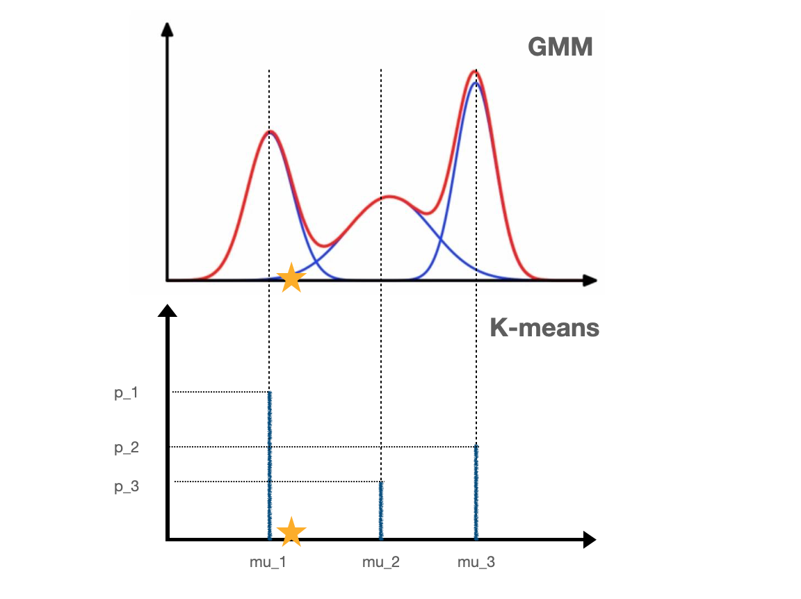

# Kmeans算法原理

**Kmeans算法思想：**按照样本间距离大小，划分为K个簇，使得每个簇内部的样本点尽量紧密，簇之间的样本点离得尽量远。

假设簇的划分为$(C_1,C_2,\dots,C_K)$，Kmeans的目标是最小化平方误差$\sum\limits_{i=1}^n\sum\limits_{x_i\in C_k}||x_i-\mu_k||_2^2$，其中$\mu_k=\frac{1}{|C_k|}\sum\limits_{x\in C_k}x$为$C_k$的质心。

**Kmeans算法流程：**（类别数K已经选定）

1. 初始化簇的划分$C=\{C_1,C_2,\dots,C_K\}$和质心$\{\mu_1,\mu_2,\dots,\mu_K\}$
2. 对于每一轮迭代：
   1. 每个计算样本$x_i$与$\mu_k$之间的距离$d_{ik}=||x_i-\mu_k||^2_2$，假如$d_{ij} = \min\limits_{k}||x_i-\mu_k||$，将样本归为$C_j=C_j\cup\{x_i\}$
   2. 得到了新的划分C，重新计算每个簇的质心$\mu_k=\frac{1}{|C_k|}\sum\limits_{x\in C_k}x$
3. 质心不再发生变化了，说明算法已经收敛，输出最终的划分C

# Kmeans与GMM、EM算法的关系

最直观的感受是Kmeans算法也是迭代的求解最优的参数（质心）。事实上，Kmeans可以看作是GMM的特殊情况。

回顾一下GMM（详见GMM博客），引入隐变量Z服从一个离散的分布$p_k$， $k=1,\dots,K$，当Z属于第k个取值时，X服从高斯分布$N(\mu_k,\Sigma_k)$，GMM就是找到参数$p_k,\mu_k,\Sigma_k$使得X的log-likelihood$\sum\limits_{i}\log p(x|p,\mu,\Sigma)$达到最大。

## GMM如何变成Kmeans？

将GMM里面每个component的协方差矩阵$\Sigma_k$都变为$\epsilon I$，这样高斯分布的协方差就固定了，不需要再参数估计。

将$\Sigma_k=\epsilon I$固定之后，会有什么影响？样本点$x_i$的后验概率为
$$
\begin{array}{rl}
p(z_i=C_k|x_i) & = \frac{p(x_i,z_i=C_k)}{p(x_i)}\\
& = \frac{p_kN(x_i|\mu_k,\Sigma_k)}{\sum\limits_{j=1}^Kp_jN(x_i|\mu_j,\Sigma_j)}\\
& = \frac{p_k\exp\{-||x_i-\mu_k||^2/2\epsilon\}}{\sum\limits_{j=1}^Kp_j\exp\{-||x_i-\mu_j||^2/2\epsilon\}}
\end{array}
$$
当$\epsilon\rightarrow0$，上式分母中最小的一项为$||x_i-\mu_j||^2$，最慢的趋向于0. 所以当$\epsilon\rightarrow0$时，$p(z_i=C_k|x_i)$中其他项都趋近于0，只有$|||x_i-\mu_j||^2$那一项比较大，所以
$$
p(z_i=C_k|x_i)=\begin{cases}
0,~~if~~k\neq j\\
1,~~if ~~k=j\\
\end{cases}
$$

所以，我们得到了样本点分配到簇的hard assignment，正如Kmeans算法，每个样本点会被分配到离它最近的簇。

> [2] Means algorithm performs *hard* assignment of data points to cluster, in which each data point is associated uniquely with one cluster, the EM algorithm makes a *soft* assignment based on the posterior probabilities.

## Kmeans的E-step

GMM中的E-step是最大化Q函数
$$
\begin{array}{rl}
Q(\theta,\theta^{(t)}) & = \sum\limits_{i=1}^n\sum\limits_{k=1}^{K}\log p_{k}N(x_i|p_{k},\Sigma_k)\cdot p(z_i=C_k|x_i)\\
& = \sum\limits_{i=1}^n\sum\limits_{k=1}^K(\log p_k + \log N(x_i|p_k,\Sigma_k))\cdot p(z_i=C_k|x_i)
\end{array}
$$
当$\epsilon\rightarrow 0$时，如果只考虑参数$\mu$（不考虑参数$p$），把化简之后的后验概率$p(z_i=C_k|x_i)$代入Q函数，得到
$$
Q(\mu,\mu^{(t)}) = -\frac{1}{2}\sum\limits_{i=1}^n\sum\limits_{k=1}^{K}||x_i-\mu_k||^2+const
$$
因此，经过化简之后的GMM的最大化Q函数，实际上就是最小化每个点到最近质心的距离之和，与Kmeans的算法一致。

## Kmeans的M-step

GMM中参数$\mu$和$p$迭代的公式为：
$$
\begin{array}{rl}
\mu_k^{(t+1)} & = \frac{\sum\limits_{i=1}^np(z_i=C_k|x_i,\theta^{(t)})x_i}{\sum\limits_{i=1}^np(z_i=C_k|x_i,\theta^{(t)})}\\
p^{(t+1)}_k & = \frac{1}{n}\sum\limits_{i=1}^np(z_i=C_k|x_i,\theta^{(t)})
\end{array}
$$
经过化简之后

- $\mu_k^{(t+1)} = \sum\limits_{i\in C_k}\frac{x_i}{|C_k|}$，即为属于第k个簇的样本均值，与Kmeans算法一致；

- $p_k^{(t+1)} = \frac{|C_k|}{n}$，即为每个簇占总样本的比例，不过在Kmeans算法里，这个参数不再重要。

## 图解

下面2幅图是一维GMM和Kmeans的比较，当$\epsilon\rightarrow0$时，$\epsilon I$表示高斯分布几乎没有variance，GMM从上图变成下图的样子。

从混合模型的角度出发，GMM的点（例如图中的黄色星星）有一定的概率三种不同的高斯分布，但是Kmeans只有一种选择，那就是离这个点最近的$\mu$. 

GMM的目标是确定三个高斯分布的参数，使得样本点的log-likelihood达到最大；而Kmeans的目标是确定$\mu_1,\mu_2,\mu_3$的值，使得样本点到最近$\mu$值的距离之和最小。从图容易理解，Kmeans里面参数$p$不再重要，只需要找到最佳的参数$\mu$.

如果是样本是三维的话，Kmeans由于是GMM的协方差矩阵取$\epsilon I$的特殊情况，所以Kmeans是在球形范围内寻找样本点，GMM是椭球形范围内寻找。

因为Kmeans是简化之后的GMM，Kmeans的收敛速度更快。

# References

1. [K-Means聚类算法原理 Pinard](https://www.cnblogs.com/pinard/p/6164214.html)
2. PRML Chapter 9.3.2
3. [请问如何用数学方法证明K-means是EM算法的特例？](https://www.zhihu.com/question/49972233)