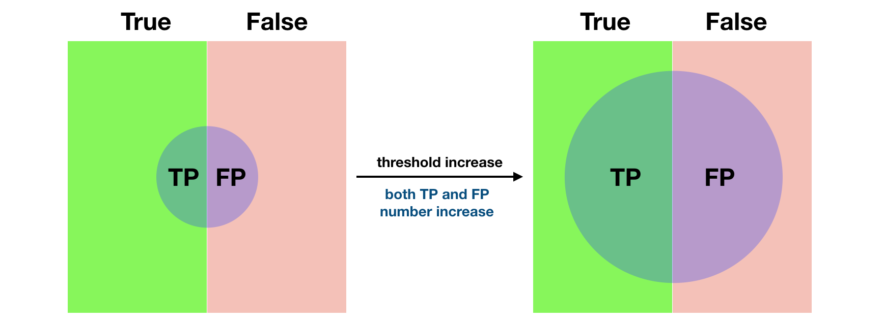

> 纪念武汉疫情，从2月3日返沪至今，一直在家隔离，向医护人员致敬

ROC和PR曲线都是处理样本imbalanced label时候实用的评价指标，如果一条ROC（或PR）曲线被另一条完全“包住”，则后者优于前者；若两者出现交叉，则很难判断，可使用AUC来求曲线下的面积，通过一个数值的大小来判断。

# ROC曲线

## ROC的定义

ROC曲线常用于二分类问题。曲线的横纵坐标分别为FPR和TPR：
$$
FPR = \frac{FP}{N}=\frac{FP}{FP+TN}, ~~TPR = \frac{TP}{P}=\frac{TP}{TP+FN}
$$
FPR和TPR的分母均为真实的label，分子为预测为positive的FP和TP。当一个正样本被预测为positive，TPR升高；如果一个负样本被预测为positive，FPR升高。

假设一个二分类模型（如逻辑回归）预测得到的样本为positive的概率值，阈值（threshold）的选取，影响着TPR和FPR。某一个threshold只对应着一组(FPR, TPR)，即ROC曲线上的一个点。Threshold从大到小不断移动，对应着不同threshold下的TPR和FPR，这些点连成线即为ROC曲线。

随着threshold变小，成为postive的标准一再降低，越来越多的样本被预测为positive，无论它本事是正样本还是负样本。因此，ROC曲线是FPR关于TPR的单调曲线。Threshold很大时太严苛，几乎所有样本都不被预测为positive，即ROC曲线的(0, 0)点；threshold很小时太宽松，几乎所有样本都预测为positive，即ROC的(1, 1)点。因为，随着threshold由大变小，ROC曲线从(0, 0)单调变化至(1, 1)。

相对于ROC曲线，random guess是连接(0, 0)和(1, 1)的直线。Random guess指，无论一个样本label为1或0，模型预测它为positive的概率是一样的(FPR=TPR)，相当于**随便**挑一定比例的样本为positive，这个比例跟threshold有关。

ROC越靠近左上角越好，比random guess好。因此对于任意的threshold，都有TPR$\ge$FPR，即$\frac{TP}{P}\ge\frac{FP}{N}$，所以$\frac{TP}{FP}\ge\frac{P}{N}$，正例被判为正例的概率大于负例被判为正例的概率，模型有更好的预测能力。

ROC曲线对输出为概率的二元分类模型比较友好，可以按照概率值逆序排列，将样本的概率值为threshold，逐步绘制ROC曲线：threshold先设为最大，所有样本均为反例，曲线经过(0, 0)点，然后将threshold依次设为每个样本的概率，并将这个样本划分为positive，若该样本为正样本，则$TPR+\frac{1}{P}$，若为负样本，则$FPR+\frac{1}{N}$，最后用线段连接所有(FPR, TPR)点。

## ROC的优点

1. TPR考虑正样本，FPR考虑负样本，所以ROC对正、负样本兼顾。
2. ROC的指标TPR、FPR都是比例，不依赖于样本类别的分布。
3. TPR的分母是正样本数，FPR的分母是负样本数，正样本或者负样本总数发生变化（例如比例相差很大），不会影响到另一部分。而Precision=TP/(TP+FP)的分母来自正、负样本两部分，易受类别分布影响。假设负样本增加10倍，ROC曲线不变，因为FP和N都增加了，但PR曲线会变化较大，因为FP增加，precision变了。这也是ROC的优点，具有鲁棒性，**在类别分布发生明显变化时依然能识别较好的分类器**。同一个模型用在不同的样本集上，能够得到相似的ROC曲线。

## ROC的缺点

- 优点3.提到**ROC不会随类别分布的改变而改变**，既是优点也是缺点。例如负样本N增加10倍，会产生更多的FP，但ROC曲线却没怎么变。信息检索领域特别在乎precision，这就无法接受：同一个模型在两个不同样本集上ROC表现相似，但在负样本远多的那个样本上，precision会小很多。

- **label不平衡情况下**，负样本数量众多，并不会使FPR明显增大，导致**ROC评估过分乐观**。当负样本数量远超正样本，FP大量增加，大量负样本被预测为positive，却只换来FPR的微小改变，ROC曲线无法体现。

# PR曲线

Precision-Recall曲线，纵坐标precision = TP/(TP+FP)，横坐标recall = TPR = TP/(TP+FN)。查准率和查全率是一对矛盾的度量，一般来说，查准率高时，查全率往往偏低，查全率高时，查准率往往偏低。

PR曲线的两个指标都只关注正样本。PR曲线的绘制方法与ROC类似，可参考[1]。

# AUC

无论ROC还是PR曲线，都可以用AUC来衡量分类器的效果。

ROC曲线围成的面积 (即ROC-AUC)可以解读为：从所有正例中随机选取一个样本A，再从所有负例中随机选取一个样本B，分类器将A判为正例的概率比将B判为正例的概率大的可能性。

从另一个角度看，由于画ROC曲线时都是先将所有样本按分类器的预测概率排序，所以**AUC反映的是分类器对样本的排序能力**，依照上面的例子就是A排在B前面的概率。AUC越大，自然排序能力越好，即分类器将越多的正样本排在负样本之前。即AUC越大，正样本的预测结果更加靠前。

> [3] The AUC value is equivalent to the probability that a randomly chosen positive example is ranked higher than a randomly chosen negative example. 例如0.7的AUC，其含义可以大概理解为：给定**一个正样本**和**一个负样本**，在70%的情况下，模型对正样本的打分高于对负样本的打分。

# ROC与PR的比较

1. ROC曲线兼顾正样本与负样本，所以适用于评估分类器的整体性能，相比而言PR曲线完全聚焦于正样本。

2. 类别不平衡问题，常常只关心正样本的预测情况，所以该**一般情况**下PR曲线被认为优于ROC曲线。如果想要评估在**相同**的类别分布下正样本的预测情况，适合选PR曲线。参考[1]的imbalance样本的例子，ROC-AUC为0.8左右，PR-AUC为0.68左右，ROC估计比较乐观，因为precision受到FP的影响，PR-AUC会低一些。

3. 如果有**多份数据**且存在**不同**的类别分布，比如信用卡欺诈问题中每个月正、负样本的比例可能都不相同，这时候如果只想单纯地比较分类器的性能且剔除类别分布改变的影响，则ROC曲线比较适合，因为类别分布改变可能使得PR曲线发生变化时好时坏，难以进行模型比较；反之，如果想测试不同类别分布下对分类器的性能的影响，则PR曲线比较适合。

4. 根据实际情况，选择ROC或者PR来评估分类器，找到曲线上最优的点，选择最合适的threshold

5. （总结）在固定的数据集上，PR曲线更直观的反映其性能。假如数据集不同（如不同的测试集），PR曲线的变化太大，ROC曲线更加稳定。

6. （总结）[4] If your model needs to perform equally well on the positive class as the negative class (for example, for classifying images between cats and dogs, you would like the model to perform well on the cats as well as on the dogs. For this you would use the ROC AUC.

   On the other hand, if you're not really interested in how the model performs on the negative class, but just want to make sure every positive prediction is correct (precision), and that you get as many of the positives predicted as positives as possible (recall), then you should choose PR AUC.

# References：

1. （重点参考）[机器学习之类别不平衡问题 (2) —— ROC和PR曲线](https://zhuanlan.zhihu.com/p/34655990)
2. [P-R曲线及与ROC曲线区别](https://www.cnblogs.com/gczr/p/10137063.html)

3. [分类模型评估之ROC-AUC曲线和PRC曲线](https://blog.csdn.net/pipisorry/article/details/51788927)
4. [Precision-Recall AUC vs ROC AUC for class imbalance problems](https://www.kaggle.com/general/7517)