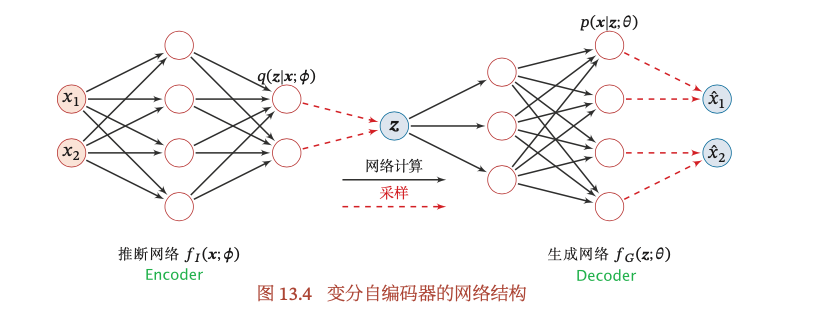
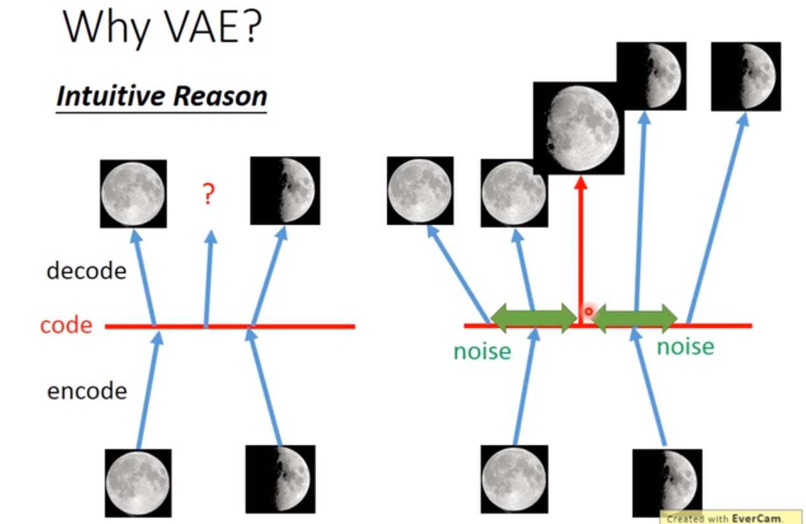
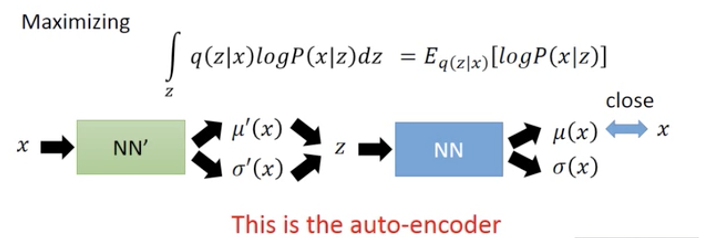
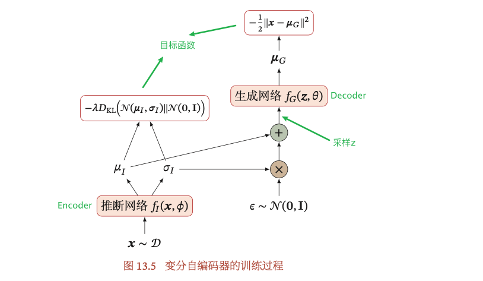

VAE是一个生成模型，**生成模型一般具有两个基本功能：密度估计$P(X)$和生成样本**[2]。本文先从一些其他的模型，比如GMM和Auto-Encoder，来引入VAE，这样可以更好的理解什么是VAE。然后再解释VAE的理论细节。

# 从GMM到VAE 

VAE也是latent variable model. **如果GMM是K个高斯分布的混合，那么VAE是无限多个高斯分布的混合**。高斯分布只有K个高斯分布的混合$P(Z)=p_k$，无法处理复杂的任务，只能做简单的聚类。

但实际中样本绝不仅仅属于某几个类那么简单，用distributed representation比聚类会更好的表示样本：样本有不同的latent attributes，比如关于疾病的人口样本的latent attributes有职业、生活习惯等等，所以latent attributes可以**用向量来描述各个不同的attribute（多维的），而且服从某种分布**[3]。VAE就是GMM的distributed representation版本，是GMM的推广。

一般假设VAE的latent attritbutes服从高斯分布$Z\sim N(0,I)$，是**连续的+高维的**。从这个分布Z中采样得到一个向量z，向量z的每一个维度，代表一种latent attribute. 上图假设Z是一维的高斯分布，实际上可以是高维的高斯分布。采样得到z之后，可以根据z来决定X的分布。相比GMM，只有K个不同的$\mu,\Sigma$，但在VAE中，z的采样有无穷多种可能，所以$\mu,\Sigma$也有无穷多种可能。如何做到$\mu,\Sigma$也有无穷多种可能呢？把$\mu,\Sigma$看成是关于z的函数（神经网络就是一个函数）！如果X是连续的，$X|z\sim N(\mu(z), \Sigma(z))$. 
$$
p_{\theta}(X) = \int_{Z}p_{\theta}(X,Z) = \int_Zp(Z)p_{\theta}(X|Z)dZ
$$
因为Z是高维的，所以上面的积分，即$p(X)$是intractable，所以后验$$p_{\theta}(Z|X)=p(Z)P_{\theta}(X|Z)/p_{\theta}(X)$$是intractable. 

# 从Auto-Encoder到VAE

VAE指的是Variational Auto-Encoder，这一节就讨论Auto-Encoder与VAE之间的关系。

Auto-Encoder是由encoder和decoder两部分组成，样本经过encoder变成一段code，code再通过decoder变回去，希望输出的结果与样本越接近越好（code往往是比样本有更低的维度）。训练完Auto-Encoder之后，可以把decoder单独拎出来，给decoder输入任意的code，就会得到不同的样本，起到了生成模型的作用。

VAE同样有encoder和decoder，与Auto-Encoder不同的是：**中间得到的不是确定性的code，而是一个分布（或分布的参数）。**上图中的latent attributes是三维的，所以先输出1组三维的均值向量和1组三维的方差向量，然后用标准高斯分布采样得到另外一组三维的向量，最后得到的向量$c$才对应着Auto-Encoder里面的code. 上图中的两个极小化的目标函数后面再解释。

**注意：**VAE中间步骤得到分布的参数，与神经网络里面的参与不是一回事。分布的参数是根据样本得到的确定值，是encoder的输出$\mu'(x), \Sigma'(x)$. 与上一节相类似（尽管GMM小节实际上解释的是decoder），得到的$\mu',\Sigma'$是关于输入x的函数。输入x不同，$\mu'(x), \Sigma'(x)$也不同。

## VAE比Auto-Encoder的优势

可以参照李宏毅课件的满月和弦月的例子[3]：

Auto-Encoder无法保证样本之外的code，会得到怎样的结果：假设有一张满月的图片，对应一个code，一张弦月的图片，对应另外一个code。我们想要得到一张介于满月和弦月之间的照片，理论上只需要取两个code的中间的一组向量即可，但神经网络内部是非线性的，无法保证得到的结果。只能保证已知的样本，能够尽可能高的还原。

VAE给满月（弦月）encode的时候，会额外给code引入noise（参数$\Sigma$），在noise范围内的code，经过decoder回去之后都应该还是满月（弦月）。正因为引入了noise，所以满月和弦月对应的code可能会重合一部分（就是中间的那一段）。假设目标函数的极小化MSE，那么这个部分的code，将既跟满月有点像，又跟弦月有点像，就是一张介于满月和弦月之间的图。

可以认为，经过encoder之后得到的$\mu(x)$就是Auto-Encoder的code；得到的$\Sigma(x)$是noise的variance. Decoder要根据加入noise之后的code，再重新构造得到原来的输入。但如果不加任何措施，算法会自动学习到noise的variance是0，构建误差是最小的，这就变回Auto-Encoder了。所以需要加一下限制，强迫variance不能太小，目标函数就多了一个正则项，后面再展开。

# VAE中的变分

VAE是变分的Auto-Encoder，如何理解变分呢？变分推断是寻找 一个简单分布$q(z)$来近似条件概率密度$p(z|x)$，条件概率$p(z|x)=p(x,z)/p(x)=p(x,z)/\int p(x,z)dz$，在第一小节“从GMM到VAE”的最后也提到了，计算积分不可行，所以找一个简单的分布尽可能的接近$p(z|x)$，这在EM算法以及变分推断的文章中均有提到。

回顾生成模型的一个基本功能就是密度估计，所以还是极大似然$\log p(X)$. 

VAE是调节神经网络里面的参数，得到encoder的函数$\mu'(x),\Sigma'(x)$，从分布$q(z|x)= N(\mu'(x),\Sigma'(x))$中采样得到z；decoder的函数$\mu(z),\Sigma(z)$，再从分布$N(\mu(z),\Sigma(z))$中采样得到输出$\hat{x}$，最终目的是使得log-likelihood达到最大。

变分$q(z)$的分布与原始的后验概率$p(z|x)$的参数是不同的（两个不同的神经网络的参数），所以记为$q_{\phi}(z)$和$p_{\theta}(z|x)$更加容易区分，而且VAE的encoder得到的分布的参数（即$\mu,\Sigma$）是关于x的函数，**所以$x$是固定的值**，$q$可以是任意分布，因此记为$q_{\phi}(z|x)$. 用EM算法的公式来求$q_{\theta}(Z|X)$：
$$
\begin{array}{rl}
\log p(x) & = \int_zq_{\phi}(z|x)\log(\frac{p_{\theta}(z,x)}{q_{\phi}(z|x)})dz+ KL(q_{\phi}(z|x), p_{\theta}(z|x))\\
& \ge \int_z q_{\phi}(z|x)\log\frac{p_{\theta}(x|z)p(z)}{q_{\phi}(z|x)}dz\\
& = ELBO
\end{array}
$$
**$p(z)$是已知的高斯分布（第一小节的假设），剩下的事情就是找$q_{\phi}(z|x)$和$p_{\theta}(x|z)$，使得ELBO达到最大。**这里引入的$q_{\phi}(z|x)$，与$\log p(x)$没有关系，所以通过调节变分q不会改变$\log p(x)$的大小，只是保证ELBO在增大，KL divergence在减小。又因为$\log p(x)$一定不小于ELBO，持续这样下去，一定会使$\log p(x)$达到最大。另外，如果最大化了ELBO，同时也会最小化$KL(q_{\phi}(z|x), p_{\theta}(z|x))$，得到的$q_{\phi}(z|x)$是$p_{\theta}(z|x)$的近似。

# VAE的目标函数

我们现在已经知道了通过变分法，要**同时**找到$q_{\phi}(z|x)$和$p_{\theta}(x|z)$，使得ELBO达到最大。下面就是研究$q_{\phi}(z|x)$和$p_{\theta}(x|z)$与VAE目标函数与之间的关系，以及$q_{\phi}(z|x)$、$p_{\theta}(x|z)$与encoder、decoder之间的关系。

上一节已经解释了，让ELBO越来越大，等同于log-likelihood越来越大，所以**总的目标函数就是最大化ELBO**：
$$
\begin{array}{rl}
ELBO & = \int_z q_{\phi}(z|x)\log\frac{p_{\theta}(x|z)p(z)}{q_{\phi}(z|x)}dz\\
& = \int_z q_{\phi}(z|x)\log\frac{p(z)}{q_{\phi}(z|x)}dz + \int_zq_{\phi}(z|x)\log p_{\theta}(x|z)dz\\
& = -KL(q_{\phi}(z|x), p(z)) + \int_zq_{\phi}(z|x)\log p_{\theta}(x|z)dz
\end{array}
$$

## $\min KL(q_{\phi}(z|x), p(z))$

$q_{\phi}(z|x)$本质上是什么？给定一个x，得到一个因变量z，其实**$q_{\phi}(z|x)$就是Encoder。**这一项是要求$q_{\phi}(z|x)$尽可能的与$p(z)$接近，也就是调节encoder，使得x对应的分布$N(\mu'(x),\Sigma'(x))$与$p(z)=N(0,I)$越接近越好。

参考paper[5]，$\min KL(q_{\phi}(z|x), p(z))$就是目标函数中的正则项，呼应了前面提到的加入正则项的事情，目的是使得noise的variance不是0，否则就变回Auto-Encoder啦。

$$
\begin{array}{rl}
-KL(q_{\phi}(z|x), p(z)) & = \int_z q_{\phi}(z|x)\Big(\log p(z) - \log q_{\phi}(z|x)\Big)dz\\
& = \int_z q_{\phi}(z|x)\log p(z)dz - \int_z q_{\phi}(z|x)\log q_{\phi}(z|x)dz\\
& = \int_z N(z;\mu,\Sigma)\log N(z;0,I)dz - \int_z N(z;\mu,\Sigma)\log N(z;\mu,\Sigma)dz\\
& = \Big(-\frac{J}{2}\log(2\pi)-\frac{1}{2}\sum\limits_{j=1}^J(\mu_j^2+\sigma_j^2)\Big)-\Big(-\frac{J}{2}\log(2\pi)-\frac{1}{2}\sum\limits_{j=1}^{J}(1+\log\sigma_j^2)\Big)\\
& = \frac{1}{2}\sum\limits_{j=1}^J\Big(1+\log(\sigma_j)^2 - (\mu_j)^2-(\sigma_j)^2\Big)
\end{array}
$$

## $\max\int_zq_{\phi}(z|x)\log p_{\theta}(x|z)dz$

$\int_zq_{\phi}(z|x)\log p_{\theta}(x|z)dz = E_{q_{\phi}(z|x)}[\log p_{\theta}(x|z)]$，指的是按照$q_{\phi}(z|x)$的权重来对$\log p_{\theta}(x|z)$求期望。**本质上这一项就是Auto-Encoder的功能：**给定x，经过encoder，即$q_{\phi}(z|x)$，得到$\mu'(x)$和$\Sigma'(x)$，根据这两个参数对应的分布，采样得到z；得到z之后再最大化产生回x的概率，也就是z经过decoder，即$p_{\theta}(x|z)$，得到$\mu(z)$和$\Sigma(z)$，然后根据这两个参数对应的分布采样得到x。因此这一项就是Reconstruction Loss，让输入的x与输出的x尽可能的接近。

[2]通常情况下，这一项可通过采样的方式近似计算。对于每个样本$x$，根据$q_{\phi}(z|x)$采样M个$z^{(m)}, ~1\le m\le M.$
$$
E_{q_{\phi}(z|x)}[\log p_{\theta}(x|z)]\approx\frac{1}{M}\sum\limits_{m=1}^M\log p_{\theta}(x|z^{(m)})
$$
本来这一项与参数$\phi$有关，经过上面的采样，这一项变得与参数$\phi$无关。当神经网络使用梯度下降法来学习参数时，采样之后的近似值关于$\phi$的梯度为0，这是因为$z$与$\phi$之间不再是确定性关系，而是采样关系，需使用重参数化技巧来解决，后面再解释。

## VAE中的Encoder和Decoder

- Encoder的目标是是使得$q_{\phi}(z|x)$ 尽可能接近真实的后验$p_{\theta}(z|x)$， 需要找到一组网络参数$\phi^*$来最小化两个分布的KL散度，即$\phi^*=\arg\min\limits KL(q_{\phi}(z|x), p_{\theta}(z|x))$. 这一般无法直接计算，VAE是通过最大化ELBO间接使得KL散度最小化，因此VAE的Encoder目标是找到一组网络参数$\phi^*$使得ELBO最大化。
- Decoder的目标是找到一组网络参数$\theta^*$使得ELBO最大化。

**综上，$q_{\phi}(z|x)$是decoder对应的神经网络；$p_{\theta}(x|z)$是encoder对应的神经网络。从EM算法的角度看，Encoder和Decoder分别可以看成是EM算法的E步和M步。**目标函数分为两部分，一个是Reconstruction Loss（Decoder），另一项是正则化项（Encoder）。

# 重参数化技巧

一般假设$Z|X\sim N(\mu_{\phi}(X), \Sigma_{\phi}(X))$，$z$是经过采样得到的，所以$z$和$\phi$之间不是确定性关系，无法直接对$z$关于$\phi$求导数。可通过重参数化技巧，将$z$和$\phi$之间的随机性采样关系变成确定性关系。引入一个随机变量$\epsilon\sim N(0,I)$，假设$q_{\phi}(z|x)$服从正态分布$N(\mu_{\phi},\Sigma_{\phi})$，其中$\mu_{\phi},\Sigma_{\phi}$是Encoder的输出，依赖于参数$\phi$，通过

$$
Z = \mu_{\phi}(X) + \Sigma_{\phi}^{1/2}(X)\cdot\epsilon
$$

再参数化，这样$z$和$\phi$之间的关系变成确定性的，使得$Z|X\sim N(\mu_{\phi}(X), \Sigma_{\phi}(X))$的随机性独立于$\phi$，可以求$z$关于$\phi$的导数。

# VAE的learning、inference问题

 知道了VAE的encoder、decoder以及目标函数，后面就是如何去训练这个模型，也就是确定神经网络的参数，进而确定分布的参数$<\theta,\phi>$用于采样，在概率生成模型中也称为learning问题。训练结束之后，参数已经确定，使用先验概率$p(z)$采样用于生成样本，也称为inference问题。

>训练时如果用EM算法的公式
>- E-step： 当$q=p_{\theta}(Z|X)$时，KL divergence=0，Expectation is ELBO 
>- M-step: $\theta = \arg\max\limits_{\theta} ELBO = \arg\max\limits_{\theta} E_{p_{\theta'}(Z|X)}[\log p_{\theta}(X, Z)]$

VAE无法使用EM算法来解决，因为EM算法的前提是后验概率$p_{\theta}(Z|X)$为tractable的。但因为$p_{\theta}(Z|X)$是intractable，我们需找到$q_{\phi}(Z|X)$来逼近它：
$$
\begin{array}{rl}
<\hat{\theta}, \hat{\phi}>&=arg\min\limits_{}KL(q_{\phi}(Z|X), p_{\theta}(Z|X)) \\
& = arg\max ELBO\\
& = \arg\max E_{q_{\phi}(Z|X)}[\log p_{\theta}(X,Z)] + H[q_{\phi}]\\
& = \arg\max E_{q_{\phi}(Z|X)}[\log p_{\theta}(X|Z)] - KL(q_{\phi}(Z|X)||p(Z)) 
\end{array}
$$

上式对$\theta$或$\phi$求梯度，就可以得到想要的参数值，具体的过程可参考变分推断的求解。VAE是用神经网络训练来确定参数，而不是使用传统的变分推断方法。在learning过程中，先从X到Z，然后再从Z到X，就是从encoder到decoder的过程。**训练过程的encoder和decoder的参数是同时学习的。**

经过重参数化，VAE可通过梯度下降来学习神经网络里面的参数$\phi,\theta$。

对每个样本$x^{(i)}$，对随机变量$\epsilon$做M次采样$\epsilon^{(i,m)},~1\le m\le M$，并用重参数化技巧的公式$z^{(i,m)} = \mu_{\phi}(x) + \Sigma_{\phi}^{1/2}(x)\cdot\epsilon^{(i,m)}$计算得到$z^{(i,m)}$. 这样VAE的目标函数可写为：
$$
LB = \sum\limits_{i=1}^N\Bigg( \frac{1}{M}\sum\limits_{m=1}^M\log p_{\theta}(x^{(i)}|z^{(i,m)}) -KL\Big(q_{\phi}(z|x^{(i)}),p(z)\Big)\Bigg)
$$
如果是随机梯度下降，每次只采集一个样本和一个随机变量$\epsilon$，并假设$p_{\theta}(x|z)$服从高斯分布$N(\mu_{\theta},\lambda I)$，其中$\mu_{\theta}$为encoder的输出，$\lambda$为超参数，则VAE的目标函数可简化为：
$$
LB = -\frac{1}{2}||x-\mu_{\theta}||^2 - \lambda KL\Big( N(\mu_I,\sigma_I), N(0,I) \Big)
$$
**原本的梯度下降是对每一个样本x经过encoder之后的隐变量z进行多次采样的，随机梯度下降只采样一次。**

第一项是简化之后的Reconstruction Loss，即x与decoder分布的均值之间的距离；第二项是化简之后的正则化项，超参数$\lambda$可认为是正则化系数。这与Auto-Encoder的目标函数非常类似，但本质上是不同的。

训练过程中，decoder对应的$p_{\theta}(x|z)$里面的z，不是先验概率$p(z)$里面的z，decoder的z是由encoder $p_{\theta}(z|x)$得到的分布采样而得到的z。训练结束后，inference可用先验概率$p(z)$进行采样，用于生成样本。

# References 

1. [白板推导系列(三十二) ～ 变分自编码器(VAE)](<https://www.bilibili.com/video/BV15E411w7Pz?from=search&seid=9357319156757457518>)
2. [NNDL](https://nndl.github.io/nndl-book.pdf)重点参考
3. [李宏毅2020机器学习深度学习 P60 P61](https://www.bilibili.com/video/BV1JE411g7XF)重点参考
4. [Keras: Variational AutoEncoder](https://keras.io/examples/generative/vae/)
5. [Auto-Encoding Variational Bayes](https://arxiv.org/abs/1312.6114)
6. [Tutorial - What is a variational autoencoder?](https://jaan.io/what-is-variational-autoencoder-vae-tutorial/)
7. [Understanding Variational Autoencoders (VAEs)](https://towardsdatascience.com/understanding-variational-autoencoders-vaes-f70510919f73)不错的博客