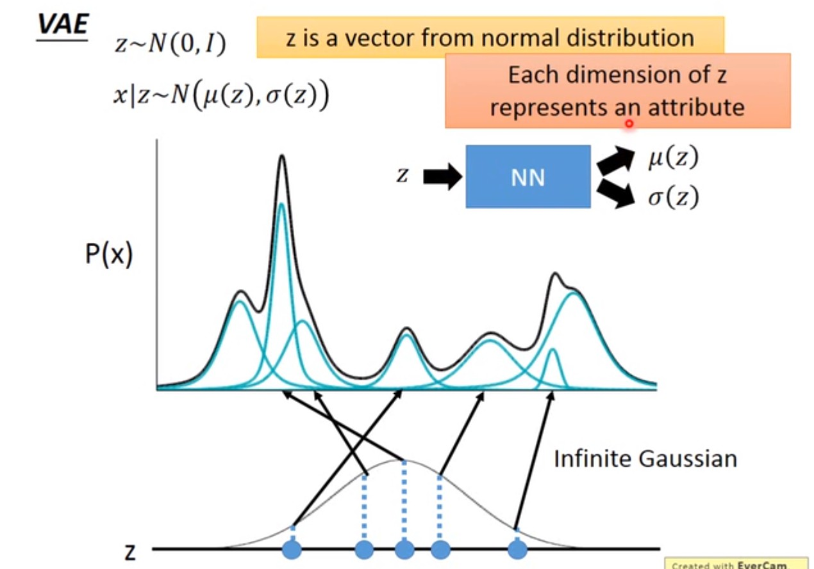

VAE是一个生成模型，**生成模型一般具有两个基本功能：密度估计$P(X)$和生成样本**[2]。本文先从一些其他的模型，比如GMM和Auto-Encoder，来引入VAE，这样可以更好的理解什么是VAE。然后再从理论上解释VAE的理论细节。

# 从GMM到VAE 

VAE也是latent variable model. 如果GMM是K个高斯分布的混合，那么VAE是无限多个高斯分布的混合。高斯分布只有K个高斯分布的混合$P(Z)=p_k$，无法处理复杂的任务，只能做简单的聚类。

但实际中样本绝不仅仅属于某几个类那么简单，用distributed representation比聚类更好的表示样本：样本有不同的latent attributes，比如关于疾病的人口样本的latent attributes有职业、生活习惯等等，所以latent attributes可以**用向量来描述各个不同的attribute（多维的），而且服从某种分布**[3]。VAE就是GMM的distributed representation版本，是GMM的推广。

一般假设VAE的latent attritbutes服从高斯分布$Z\sim N(0,I)$，是**连续的+高维的**。从这个分布Z中采样得到一个向量z，向量z的每一个维度，代表一种latent attribute. 上图假设Z是一维的高斯分布，实际上可以是高维的高斯分布。采样得到z之后，可以根据z来决定X的分布。相比GMM，只有K个不同的$\mu,\Sigma$，但在VAE中，z的采样有无穷多种可能，所以$\mu,\Sigma$也有无穷多种可能。如何做到$\mu,\Sigma$也有无穷多种可能呢？把$\mu,\Sigma$看成是关于z的函数（神经网络就是一个函数）！如果X是连续的，$X|z\sim N(\mu(z), \Sigma(z))$. 
$$
p_{\theta}(X) = \int_{Z}p_{\theta}(X,Z) = \int_Zp(Z)p_{\theta}(X|Z)dZ
$$
因为Z是高维的，所以上面的积分，即$p(X)$是intractable，所以后验$p_{\theta}(Z|X)=p(Z)P_{\theta}(X|Z)/p_{\theta}(X)$是intractable. 

# 从Auto-Encoder到VAE

VAE指的是Variational Auto-Encoder，这里就比较Auto-Encoder与VAE之间的关系。

Auto-Encoder是由encoder和decoder两部分组成，样本经过encoder变成一段code，code再通过decoder变回去，希望输出的结果与样本越接近越好（code往往是低维度的）。训练完Auto-Encoder之后，可以把decoder单独拎出来，给decoder输入任意的code，就会得到不同的样本，起到了生成模型的作用。

VAE同样有encoder和decoder，与Auto-Encoder不同的是：**中间得到的不是确定性的code，而是一个分布（或分布的参数）。**上图中的latent attributes是三维的，所以先输出1组三维的均值向量+1组三维的方差向量，然后用高斯分布采样得到另外一组三维的向量，最后得到的向量$c$才对应着Auto-Encoder里面的code. 上图中的两个极小化的目标函数后面再解释。

**注意：**VAE中间步骤得到分布的参数，与神经网络里面的参与不是一回事。分布的参数是根据样本确定的值，是encoder的输出$\mu(x), \Sigma(x)$. 与上一节相类似（尽管GMM小节实际上解释的是decoder），得到的$\mu,\Sigma$是关于输入x的函数。输入x不同，$\mu, \Sigma$也不同。

## VAE比Auto-Encoder的优势

可以参照李宏毅课件的满月和弦月的例子[3]。

Auto-Encoder无法保证样本之外的code，会得到怎样的结果：假设有一张满月的图片，对应一个code，一张弦月的图片，对应另外一个code。我们想要得到一张介于满月和弦月之间的照片，理论上只需要取两个code的中间的一组向量即可，但神经网络内部是非线性的，无法保证得到的结果。只能保证已知的样本，能够尽可能高的还原。

VAE给满月（弦月）encode的时候，会额外给code引入noise（即为参数$\Sigma$），在noise范围内的code，经过decode回去之后都应该还是满月（弦月）。正因为引入了noise，所以满月和弦月对应的code可能会重合一部分（就是中间的那一段）。假设目标函数的极小化MSE，那么这个部分的code，将既跟满月有点像，又跟弦月有点像，就是一张介于满月和弦月之间的图。

可以认为，经过encoder之后得到的$\mu(x)$就是Auto-Encoder的code；得到的$\Sigma(x)$是noise的variance. Decoder要根据加入noise之后的code，再重新构造得到原来的输入。但如果不加任何措施，算法会自动学习到noise的variance是0，构建误差是最小的，这就变回Auto-Encoder了。所以需要加一下限制，强迫variance不能太小，目标函数就多了一个正则项，后面再展开。

# VAE中的变分

# VAE的learning、inference问题 

如果用EM算法的公式来求$q_{\theta}(Z|X)$：
$$
\log p(X) = ELBO + KL(q_{\phi}(Z|X), p_{\theta}(Z|X))
$$

- E-step： 当$q=p_{\theta}(Z|X)$时，KL divergence=0，Expectation is ELBO 
- M-step: $\theta = \arg\max\limits_{\theta} ELBO = \arg\max\limits_{\theta} E_{p_{\theta'}(Z|X)}[\log p_{\theta}(X, Z)]$

但VAE无法使用EM算法来解决，因为EM算法的前提是后验概率$p_{\theta}(Z|X)$为tractable的。但因为$p_{\theta}(Z|X)$是intractable，我们用$q_{\phi}(Z|X)$来逼近它。那就只能找到一个q来逼近后验概率：
$$
\begin{array}{rl}
<\hat{\theta}, \hat{\phi}>&=arg\min\limits_{}KL(q_{\phi}(Z|X), p_{\theta}(Z|X)) \\
& = arg\max ELBO\\
& = \arg\max E_{q_{\phi}(Z|X)}[\log p_{\theta}(X,Z)] + H[q_{\phi}]\\
& = \arg\max E_{q_{\phi}(Z|X)}[\log p_{\theta}(X|Z)] - KL(q_{\phi}(Z|X)||p(Z)) 
\end{array}
$$

上式对$\theta$或$\phi$求梯度，就可以得到想要的参数值，具体的过程也参考变分推断的求解。

一般假设$Z|X\sim N(\mu_{\phi}(X), \Sigma_{\phi}(X))$，经过重参数化技巧，$Z = \mu_{\phi}(X) + \Sigma_{\phi}^{1/2}(X)\cdot\epsilon$.  

考虑公式里的$\log p_{\theta}(X|Z)$，是给定Z的情况下看X，是decoder；Z是来自于$q_{\phi}(Z|X)$，是encoder。在learning过程中，先从X到Z，然后再从Z到X，就是从encoder到decoder的过程。公式里的第二项KL divergence是正则化项。

# References 

1. [白板推导系列(三十二) ～ 变分自编码器(VAE)](<https://www.bilibili.com/video/BV15E411w7Pz?from=search&seid=9357319156757457518>)
2. [NNDL](https://nndl.github.io/nndl-book.pdf)

3. [李宏毅2020机器学习深度学习 P60 P61](https://www.bilibili.com/video/BV1JE411g7XF)

4. [Keras: Variational AutoEncoder](https://keras.io/examples/generative/vae/)