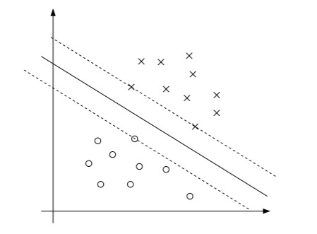

本文主要介绍拉格朗日对偶与SVM的关系，以及为什么要用对偶来解决
# 拉格朗日对偶
## Primal问题
考虑极小化问题

$$
\begin{array}{ll}
\text{min}  & f(w) \\
\text{s.t.} & g_j(w) \le 0, ~~j= 1,\dots, k\\
            & h_i(w) = 0,  ~~i =1,\dots, l
\end{array}
$$

对于基本的SVM模型，$f(x)=\frac{1}{2}||w||^2$，$g_j(w)=-y_i(w^Tx_i+b)+1\le 0$。

定义拉格朗日函数为：$$\mathcal{L}(w,\alpha,\beta)=f(w)+\sum\limits_{i=1}^k\alpha_ig_i(w)+\sum\limits_{i=1}^l\beta_ih_i(w)$$，将有约束问题变成无约束的。这里使用的拉格朗日乘子的符号跟上一篇文章的不一样，不过不影响阅读。

令$$\theta_P(w) = \max\limits_{\alpha\ge0,\beta}\mathcal{L}(w,\alpha,\beta)$$.我们发现，对于任意给定的$w$，如果$w$违反了约束条件（即$g_i(w)>0$或者$h_i(w)\neq0$），则存在某组拉格朗日乘子，使得$\theta_P(w)=\infty$；相反，如果$w$满足约束条件，$\theta_P(w)=f(w)$。因此，
$$\theta_P(w)=
\begin{cases}
f(w), & \text{if w satisfies primal constraints} \\ 
\infty, & \text{otherwise}
\end{cases}$$

__为什么__ 要构造$\theta_P(w)$
- $\theta_P(w)$与原函数$f(w)$在$w$满足约束时取值相等，考虑极小化$\theta_P(w)$与极小化原问题等价；
- 同时，又构造出$\min\max$的形式，方便后面求拉格朗日对偶

因此，考虑极小化问题 $$\min\limits_w\theta_P(w)=\min\limits_w\max\limits_{\alpha\ge0,\beta}\mathcal{L}(w,\alpha,\beta)$$，与极小化原问题的解相同。

## Dual问题

拉格朗日对偶（已经是无约束了），是将Primal问题的$\min$和$\max$互换，即可得到对偶问题$\max\limits_{\alpha\ge 0,\beta}\min\limits_w\mathcal{L}(w,\alpha,\beta)$，就这么简单嘎嘎。

Primal问题和Dual问题是有关联的：Primal问题的最优值，是大于等于对偶问题的最优值（弱对偶性）。即
$$d^* = \max\limits_{\alpha\ge 0,\beta}\min\limits_w\mathcal{L}(w,\alpha,\beta) \le \min\limits_w\max\limits_{\alpha\ge0,\beta}\mathcal{L}(w,\alpha,\beta) = p^*$$ 
在特定情况下（Slater条件，这里不详细解释），我们有$$d^* = p^*$$(强对偶性)。在满足Slater条件时，必存在一组$$w^*,\alpha^*,\beta^*$$，使得
- $$w^*$$是Primal问题的解，
- $$\alpha^*,\beta^*$$是Dual问题的解，
- 并且$$p^*=d^*=\mathcal{L}(w^*,\alpha^*,\beta^*)$$
- $$w^*, \alpha^*,\beta^*$$满足KKT条件：

$$\begin{array}{rl}
    \frac{\partial}{\partial w_i}\mathcal{L}(w^*,\alpha^*,\beta^*) = 0, & i =1,\dots, n \\
    \frac{\partial}{\partial \beta_i}\mathcal{L}(w^*, \alpha^*, \beta^*) =0 , & i = 1,\dots, l \\
    \alpha^*_i g_i(w^*)  = 0, & i = 1, \dots,k \\ 
    g_i(w^*)\le 0, & i = 1,\dots, k \\
    \alpha^* \ge 0, & i = 1,\dots, k
\end{array}
$$
 - 另外，如果某组$$w^*, \alpha^*,\beta^*$$满足KKT条件，则它也是原问题和对偶问题的解。

KKT条件的第三组等式称为松弛互补条件，当$$\alpha^*>0$$时，有$$g_i(w^*)=0$$，即该约束条件$g_i(w^*)\le 0$达到等号，是"起作用"的约束条件。

__在SVM模型中，每个训练样本点都代表一个不等式约束，那些达到等号的不等式约束，就是到分割超平面记录严格等于1的点，就是支撑向量（support vector）。SVM模型只需要确定这少数的几个支撑向量（即等式约束，即$\alpha^*>0$的点）。__

# 对偶在SVM上的应用
## 支撑向量
SVM的目标是找到最优的分割超平面，使得支撑向量到这个平面的距离最大，即能够最大程度的区分两类样本。假设总共有$m$个训练样本，每个样本有$n$个特征，__目前$m, n$的大小关系不重要，后面会讨论什么时候更加适合使用对偶的思想__。SVM的数学规划形式为：
$$\begin{array}{rl}
    \min\limits_{w,b} & \frac{1}{2}||w||^2 \\ 
    \text{s.t.}       & y_i(w^Tx_i+b)\ge 1 , i=1,\dots,m
\end{array}
$$
我们把模型的约束条件改写为$g_i(w)=-y_i(w^Tx_i+b)+1\le 0$，与前文的格式保持一致。每一个训练样本，都对应这样一个不等式约束$g(w)$。

上图有三个支撑向量，这三个点的margin最小，这三个点对应的$g(w)=0$，也就是在最优解中，只有这三个点对应的$\alpha$可能大于0，其余点对应的$\alpha$都只能等于0（因为松弛互补条件）。一般的，支撑向量的数量比训练集合小很多。__如果我们能找到一种计算方式，使得在做预测的时候，只需要考虑这几个支撑向量，那么这个问题将变得容易很多。__

## 对偶问题
我们来验证拉格朗日对偶能不能帮到我们：首先将原始SVM模型改写成无约束形式，
$$\mathcal{L}(w,b,\alpha) = \frac{1}{2}||w||^2 - \sum\limits_{i=1}^m\alpha_i[y_i(w^Tx_i+b)-1].$$
然后考虑它的对偶形式$$\max\limits_{\alpha\ge 0}\min\limits_{w,b}\mathcal{L}(w,b,\alpha)$$.先求内部的min，固定$\alpha$，求出$w,b$使得$\mathcal{L}(w,b,\alpha)$极小化，这个过程很简单，就是求$\frac{\partial}{\partial w}\mathcal{L}=0$，$\frac{\partial}{\partial b}\mathcal{L}=0$.
$$\frac{\partial}{\partial w}\mathcal{L}(w,b,\alpha) = w - \sum\limits_{i=1}^m\alpha_iy_ix_i =0 ~~~\Rightarrow~~~  w = \sum\limits_{i=1}^m\alpha_iy_ix_i$$

$$\frac{\partial}{\partial b}\mathcal{L}(w,b,\alpha) = \sum\limits_{i=1}^m\alpha_iy_i=0$$

把以上两个关系式带入拉格朗日函数，得到的是$\min\limits_{w,b}\mathcal{L}$的表达式
$$\begin{array}{ll}
\min\limits_{w,b}\mathcal{L}(w,b,\alpha) & = \frac{1}{2}(\sum\limits_{i=1}^m\alpha_iy_ix_i)^2 - \sum\limits_{i=1}^m\alpha_iy_ix_i(\sum\limits_{i=1}^m\alpha_iy_ix_i) - b\sum\limits_{i=1}^m\alpha_iy_i + \sum\limits_{i=1}^m\alpha_i\\
            & = \sum\limits_{i=1}^m\alpha_i - \frac{1}{2}(\sum\limits_{i=1}^m\alpha_iy_ix_i)^2 \\
            & = \sum\limits_{i=1}^m\alpha_i -  \frac{1}{2}\sum\limits_{j,j=1}^my_iy_j\alpha_i\alpha_jx_i^Tx_j
\end{array}$$

现在把得到的$$\min\limits_{w,b}\mathcal{L}$$的以上表达式，外面套上$\max\limits_{\alpha\ge 0}$，得到下面的规划：
$$\begin{array}{rl}
\max\limits_{\alpha} & \sum\limits_{i=1}^m\alpha_i -  \frac{1}{2}\sum\limits_{j,j=1}^my_iy_j\alpha_i\alpha_jx_i^Tx_j \\
s.t.    & \alpha_i\ge 0, i=1,\dots, m \\
        & \sum\limits_{i=1}^m\alpha_iy_i = 0
\end{array}$$

注意，__这个规划的变量只有$\alpha$__。因为SVM的规划符合强对偶性，所以有$$p^*=d^*$$，因此我们可以通过求解SVM的对偶问题来解原问题。回忆我们之前讲的，只有支撑向量对应的$\alpha$才可能不为0，其他的全为0。所以对偶问题的解$$\alpha_i(i=1,\dots,m)$$，一定满足大多数均为0，只有少数几个不为0. 后面通过SMO算法可以求解此对偶问题。求解出来$$\alpha_i$$之后，可以通过$w = \sum\limits_{i=1}^m\alpha_iy_ix_i$ 进而求得$w^*$.再通过
$$b^* = -\frac{\max\limits_{i:y_i=-1}w^{*T}x_i + \min\limits_{i:y_i=1}w^{*T}x_i }{2}
$$
求得$b^*$.

# 灵魂拷问：为什么要用对偶？
1. （__第一个核心点__）让我们回头再看看等式$w = \sum\limits_{i=1}^m\alpha_iy_ix_i$，完全用$\alpha$来表示最优的参数$w$。假设我们已经通过训练确定了参数$w$和$b$，现在要预测一个新的样本点$x$，我们要计算的是$w^Tx+b$，并根据结果的正负来决定$y$取值为1还是0.
$$\begin{array}{ll}
w^Tx+b & = (\sum\limits_{i=1}^m\alpha_iy_ix_i)^Tx+b \\
       & = \sum\limits_{i=1}^m\alpha_iy_i(x_i^Tx) +b
\end{array}$$
我们早已发现，除了那些支撑向量外，其余的点对应的$\alpha$均为0。所以上式的求和项中，许多项直接为0，我们只需要计算支撑向量跟$x$的乘积。所以通过对偶的方法，引入了$\alpha$，在做预测时，计算变得非常简便。

2. （__第二个核心点__）通过对偶，目标函数有$x_i^Tx_j$的形式，可以引入Kenel trick

3. 原问题的拉格朗日函数$$\min\limits_{w,b}\max\limits_{\alpha\ge 0}\mathcal{L}(w,b,\alpha)$$，内测求$$\theta = \max\limits_{\alpha\ge 0}\mathcal{L}$$的部分，因为有约束条件$$\alpha\ge 0$$的缘故，求极值点比较困难，因为$$\frac{\partial\theta}{\partial\alpha_i}=0$$的$$\alpha$$不一定在$$\alpha\ge 0$$时达到。
但对偶问题先求$\min\limits_{w,b}\mathcal{L}$，$w,b$均没有限制，直接求偏导数等于0，得到一些关系式，带回拉格朗日函数消去$w,b$。然后再通过SMO算法来求解外侧的max部分。

# 参考资料
- 重点参考Andrew Ng的[Lecture notes](http://cs229.stanford.edu/notes/cs229-notes3.pdf)

# Open问题
- 如果从拉格朗日对偶来推导出KKT条件？目前的资料都是建立在强对偶的条件下，得到KKT。但KKT不一定要在强对偶时才能使用。