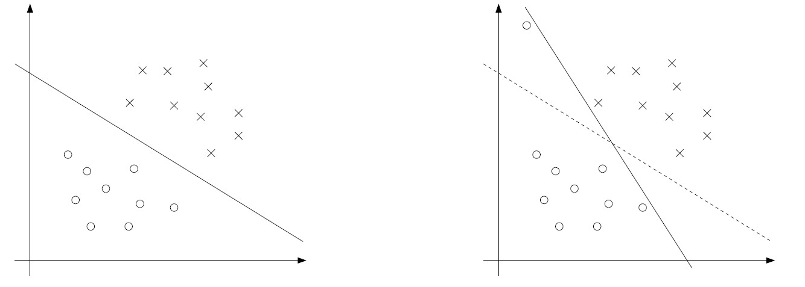
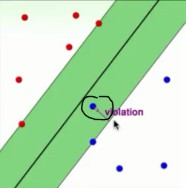
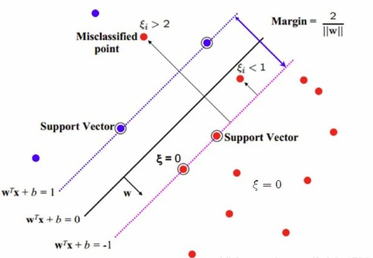
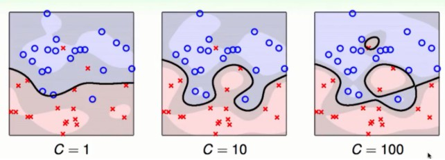
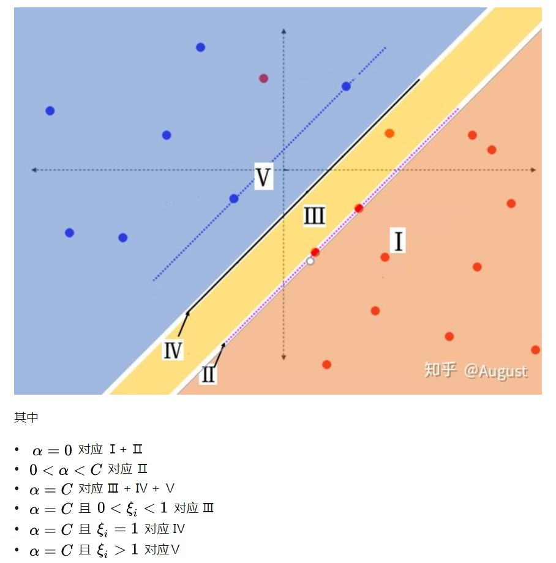

# 从hard margin到soft margin
之前对SVM的讨论，都是假设数据是线性可分的。通过使用Kernel trick可以将特征映射到更高维的空间，也可以增加数据线性可分的可能性（likelihood），但是我们不能保证Kernel trick一直都能起作用。
另一方面，即使这个数据是线性可分的，可能存在某些噪声（outlier）点，恰巧是支持向量，从而干扰了分割超平面的选择。如下图，某个outlier干扰了分割超平面：

为了让算法能够分割线性不可分的数据，并对outlier不那么敏感，我们引入软间隔（soft margin）：
$$\begin{array}{rl}
\min\limits_{w,b} & \frac{1}{2}||w||^2 + C\sum\limits_{i=1}^m\xi_i \\
\text{s.t.}       & y_i(w^Tx_i + b)\ge 1 - \xi_i, ~~~i=1,\dots,m \\
                  & \xi_i\ge0, ~~~i=1,\dots,m.
\end{array}$$
$\xi_i$的存在使得点的margin可以小于1. 如果某个点的margin是$1-\xi_i$，则在目标函数上要增加$C\xi_i$的代价。
注意，margin是区分正负的：
- 如果$1-\xi_i\ge 0$，说明这个点分类正确，但是在支持向量与分割超平面之间；

- 如果$1-\xi_i< 0$，说明这个点已经越过分割超平面，跑到河对岸去了- -!

参数$C$用来控制目标函数两项的相对权重：
1. $\min ||w||^2$的目标是最大化margin，
2. $\min \sum\limits_{i=1}^m\xi_i$的目标是尽可能多的找到margin至少为1的点，即正确分类的非噪声点。

参考资料1：解释了不同的C对模型的影响。参数C越大，目标函数越不能容忍错误分类的点，因为这些点对应的$\xi_i$会比较大，所以分割超平面会容易过拟合。
参考资料2：大C：我们宁愿边界小一点也要尽量不犯错误（$\xi$小一点）。小C：我们宁愿犯一点错误（$\xi$大一点）也要边界胖一点。

# 软间隔的拉格朗日对偶问题
使用拉格朗日乘子法将约束条件放到目标函数上
$$\mathcal{L}(w,b,\xi,\alpha,r) = \frac{1}{2}||w||^2 + C\sum\limits_{i=1}^m\xi_i - \sum\limits_{i=1}^m\alpha_i[y_i(w^Tx_i+b)-1+\xi_i] - \sum\limits_{i=1}^mr_i\xi_i$$
这里$$\alpha_i$$和$$r_i$$是拉格朗日乘子，然后原问题等价于$$\min\max\mathcal{L}$$，其拉格朗日对偶是$$\max\limits_{\alpha\ge 0,r\ge 0}\min\limits_{w,b,\xi}\mathcal{L}$$.
分别求解关于$w,b,\xi$导数为0的条件：
$$\begin{array}{rl}
\frac{\partial\mathcal{L}}{\partial w} = 0, \\
\frac{\partial\mathcal{L}}{\partial b} = 0, \\
\frac{\partial\mathcal{L}}{\partial \xi_i} = 0
\end{array}$$
得到$$w = \sum\limits_{i=1}^m\alpha_i y_ix_i,~~~ \sum\limits_{i=1}^m\alpha_i y_i=0, ~~~C-\alpha_i-r_i=0$$. 最终得到
$$\begin{array}{rl}
\max\limits_{\alpha} & \sum\limits_{i=1}^m\alpha_i -  \frac{1}{2}\sum\limits_{j,j=1}^my_iy_j\alpha_i\alpha_j\langle x_i,x_j\rangle \\
s.t.    & 0\le\alpha_i\le C, ~~~i=1,\dots, m \\
        & \sum\limits_{i=1}^m\alpha_iy_i = 0
\end{array}$$

与hard margin的情况一样，$w = \sum\limits_{i=1}^m\alpha_i y_ix_i$，所以通过对偶形式求得$\alpha$之后，可以求出$w$来做预测。有趣的是，软间隔加入的$\mathcal{l}_1$正则项$C\sum\xi_i$在对偶问题上只是改变了约束条件，从$0\le\alpha_i$变成$0\le\alpha_i\le C$.

# 软间隔的KKT条件
软间隔情形，KKT条件中的松弛互补条件为
$$\begin{array}{c}
\alpha_i(y_i(w^Tx_i+b)-1+\xi_i)=0 \\
r_i\xi_i = 0
\end{array}$$
1. 如果$\alpha_i=0$，由$\frac{\partial\mathcal{L}}{\partial \xi_i} = 0$得到$C-\alpha_i-r_i=0$，从而$r_i=C>0$，所以$\xi_i=0$. 因为$\alpha_i=0, \xi_i=0$，所以$y_i(w^Tx_i+b)\ge 1$，即样本要么是支持向量，要么样本被正确分类。
2. 如果$0<\alpha_i<C$，所以$r_i\neq 0$，所以有$\xi_i=0$.因此$y_i(w^Tx_i+b) = 1$，即该样本点为支持向量。
3. 如果$\alpha_i=C$, 则$y_i(w^Tx_i+b)=1-\xi_i\le 1$，说明这个样本点要么是噪声点，要么是误分类点：
    - 如果$0<\xi_i<1$，该点被正确分类，但在超平面与自己类别的支持向量之间（噪声点）
    - 如果$\xi_i=1$， 该点在分割超平面上，无法被正确分类
    - 如果$\xi_i>1$，该点是误分类点。

在证明SMO算法收敛性时会用到软间隔的KKT条件。

图片来自于参考资料3.1.
# hinge loss
Hinge loss: $L(t) = \max(0, 1-t)$.
1. 应用到SVM上，损失函数可以写成
$$\min \frac{1}{m}\sum\limits_{i=1}^m\max(0, 1 - y_i(w^Tx_i+b)) + \frac{\lambda}{2}||w||_2^2$$
2. 之前硬间隔的SVM可写成：
$$\begin{array}{rl}
\min & \frac{1}{2}||w||_2^2 \\
\text{s.t.} & y_i(w^Tx_i +b) \ge 1, ~~~i=1,\dots,m
\end{array}
$$
3. 软间隔的SVM可写成：
$$\begin{array}{rl}
\min & \frac{1}{2}||w||_2^2 + \frac{C}{m}\sum\limits_{i=1}^m\xi_i \\
\text{s.t.} & y_i(w^Tx_i +b) \ge 1-\xi_i, ~~~i=1,\dots,m \\
 & \xi_i\ge 0, ~~~i=1,\dots,m
\end{array}
$$

__硬间隔SVM和软间隔SVM形式都可以写成损失函数为Hinge loss的形式。__ 推导过程见参考资料3.1.

# 参考资料
1. [SVC Parameters When Using RBF Kernel](https://chrisalbon.com/machine_learning/support_vector_machines/svc_parameters_using_rbf_kernel/)
2. [机器学习之软间隔支持向量机（机器学习技法）](https://blog.csdn.net/qq_34993631/article/details/79340747)
3. [攀登传统机器学习的珠峰-SVM (中)](https://zhuanlan.zhihu.com/p/36379394)
    [攀登传统机器学习的珠峰-SVM (下)](https://zhuanlan.zhihu.com/p/36535299)