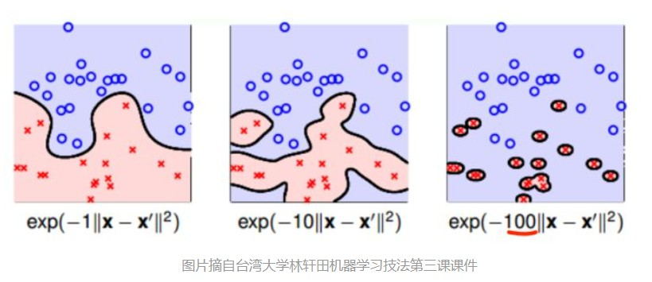

首先声明核函数的技巧是一个很大的范畴，与SVM模型平起平坐，相见参考资料1的高票回答。这里我们只讨论Kenel trick在SVM的对偶形式中的应用。
再次放出SVM的对偶形式：
$$\begin{array}{rl}
\max\limits_{\alpha} & \sum\limits_{i=1}^m\alpha_i -  \frac{1}{2}\sum\limits_{j,j=1}^my_iy_j\alpha_i\alpha_jx_i^Tx_j \\
s.t.    & \alpha_i\ge 0, i=1,\dots, m \\
        & \sum\limits_{i=1}^m\alpha_iy_i = 0
\end{array}$$
这里，$x, y$这些值都是已知的，是不同样本的特征和标签，我们要求的是$\alpha$. 对偶的目标函数里，有内积$x_i^Tx_j$，这可用于线性可分的样本集合；如果样本线性不可分，需要对特征$x$进行某些非线性变换$\phi(x)$，然后再求内积。

__一般的这些非线性变换将原来的特征映射到更高维度的空间中，使其更容易分类。__

# 特征映射(feature mapping)
先来定义一下两个不同的概念，attribute和feature，这两个词中文翻译过来都叫做特征。例如 __原始__ 的特征$x$，比如是一个房屋的面积，它可以进一步生成许多特征，比如$x,x^2,x^3$。这里原始特征$x$定义为attribute，生成的特征$x,x^2,x^3$为features。定义从attri到features这个过程为feature mapping（特征映射），记为$\phi$。在上面这个小例子中，
$$ \phi(x) = \left[
\begin{array}{c}
  x\\
  x^2\\
  x^3
\end{array}
\right] $$
对于SVM模型，我们可能不想用attributes $x$，而想用features $\phi(x)$。我们只需要把SVM对偶形式中的$x$替换成$\phi(x)$。
因为模型中的特征完全是$x^T_ix_j$的形式，可以写成向量内积的形式$$\langle x_i, x_j\rangle$$（最终结果是一个标量），所以我们可以把所有的内积替换成$$\langle \phi(x_i), \phi(x_j)\rangle$$。

# 核(Kernel)
如果有特征映射$\phi$，我们定义相应的核Kenel为
$$K(x,z) = \phi(x)^T\phi(z)$$
__所以所有出现内积$\langle x_i, x_j\rangle$的地方，我们把它们替换成核$K(x_i,x_j)$__，然后SVM算法将用features来进行机器学习。
如果已知特征映射函数$\phi$，我们可以通过找$\phi(x_i)$和$\phi(x_j)$，计算得到核$K(x_i,x_j)$。

但更有趣的是，__即使有时特征映射函数$\phi$的计算量很大，甚至可能是无穷维的，核$K(x_i,x_j)$可能计算起来非常简单。这样的话，直接计算$K(x_i,x_j)$反而更加高效，我们可以得到一个高维特征空间的SVM模型，这个特征空间其实是由特征映射函数$\phi$产生的，但是我们却不必显式的计算$\phi(x)$（可能$\phi(x)$维度太高，计算量太大）。__

__如何证明$K$是一个核？__
Kernel matrix: $K_{ij} = K(x_i,x_j)$
- Kernel matrix 是对称的；
- Kernel matrix 是半正定的

# 两个常见的核
我们考虑两个核函数，一个是将低维特征映射到高维的多项式核，另一种是将低维特征映射到无限维的高斯核（RBF）：
## 多项式核
假设$a,b\in\mathcal{R}^n$，考虑
$$K(a,b)=(a^Tb)^2$$
这里我们令$n=3$，即样本点特征的维度为3，多项式核的度数为2. 例如$a=[a_1,a_2,a_3]^T$.
将$K(a,b)$用另一种形式表示
$$\begin{array}{rl}
K(a,b) & = (\sum\limits_{i=1}^3a_ib_i)(\sum\limits_{j=1}^3a_jb_j) \\
        & = \sum\limits_{i=1}^3\sum\limits_{j=1}^3a_ia_jb_ib_j \\
        & = \sum\limits_{i,j=1}^3(a_ia_j)(b_ib_j)
\end{array}$$
这样，$K(a,b)=\phi(a)\phi(b)$，其中
$$\phi(a) = \left[
\begin{array}{c}
a_1a_1\\
a_1a_2\\
a_1a_3\\
a_2a_2\\
a_2a_3\\
a_3a_3
\end{array}
\right]
$$
- 计算特征映射函数$\phi$需要$O(n^2)$时间，然而计算核函数$K(a,b)$只需要$O(n)$时间。
- 函数$\phi$是将$\mathcal{R}^3\to\mathcal{R}^6$，更高维度。

- (参考资料2-1)即使我们知道映射函数张什么样子，我们也很难知道它对应的核会产生什么样的作用。但某些特殊情况我们可以略知一二：比如多项式核$K(a,b)=(a^Tb)^2$，对应的$\phi(a)=(a_1^2,\sqrt{2}a_1a_2,a_2^2)$. 本来特征是二维的，映射后变成三维。可以发现，本来二维的特征在一三象限的样本点被映射到三维中的同一个象限；二维特征在二四象限的样本点被映射到另一个三维象限，所以该三维特征是线性可分的。还说明一个问题，这个核可以用于分类XOR问题~

## 高斯核（RBF）
高斯核又称为Radial Basis Function (RBF).
$$ K(a,b) = e^{-\frac{||a-b||^2}{2\sigma^2}}$$
下面用最最简单的特例来证明RBF是一个核，而且是映射到无穷维的核：
考虑样本的原始特征是二维的$\mathcal{R}^2$，并假设$\gamma=\frac{1}{2\sigma^2}=1$，核可以写成
$$\begin{array}{rl}
k(a,b) & = e^{-||a-b||^2} \\
       & = e^{-(a_1-b_1)^2 - (a_2-b_2)^2} \\
       & = e^{-a_1^2+2a_1b_1-b_1^2-a_2^2+2a_2b_2-b_2^2} \\
       & = e^{-||a||^2}e^{||b||^2}e^{2a^Tb} \\
\text{(taylor series)} & = e^{-||a||^2}e^{||b||^2}\sum\limits_{n=0}^\infty\frac{(2a^Tb)^n}{n!}
\end{array}$$

- 函数$\phi$是将2维特征映射到无限维，__即RBF将每个样本的特征映射到无限维空间中__
- （参考资料2-3）证明RBF确实是一个核函数的方法
- 如果$a$和$b$很接近，则核函数$K(a,b)$接近1；如果$a$和$b$差异很大（正交），则$K(a,b)$接近于0.因此RBF核也是一种衡量$a$和$b$(或者$\phi(a)$和$\phi(b)$)相似度的指标。

## 高斯核的进一步讨论
- RBF中的gamma参数是用来干嘛的？
    $\gamma=\frac{1}{2\sigma^2}$，所以有$K(x,y) = e^{-\gamma||x-y||^2}$.
    BRF之所以称为高斯核，因为它的函数形式与高斯分布（正态分布）非常相似。
    高斯核里面的$\sigma$对应高斯分布里面的$\sigma$；高斯核里面的$y$对应高斯分布里面的$\mu$.
    如果高斯分布里面的$\sigma$变小，则高斯分布会变得又瘦又高。同理，如果$\gamma$很大，则$\sigma$就很小（脑补高斯分布又瘦又高的样子）。这样只有$x$跟$y$很接近时，$K(x,y)$才不会接近于0；否则只要$x$和$y$距离稍远一点点，$K(x,y)\to 0$.
    所以当$\gamma$变大，分割超平面会越来越复杂，甚至变成一个个分离的区域，这是因为两个样本点距离稍微远一点，就有$K(x,y)\to 0$，不敢保证中间地带的类别。
    
    
- （参考资料4）A small gamma means a Gaussian with a large variance so the influence of x_j is more, i.e. if x_j is a support vector, a small gamma implies the class of this support vector will have influence on deciding the class of the vector x_i even if the distance between them is large. If gamma is large, then variance is small implying the support vector does not have wide-spread influence. Technically speaking, large gamma leads to high bias and low variance models, and vice-versa.

- （参考资料4）The hyperparameter $\gamma$ controls the tradeoff between error due to bias and variance in your model. If you have a very large value of gamma, then even if your two inputs are quite “similar”, the value of the kernel function will be small - meaning that the support vector $x_n$ does not have much influence on the classification of the training example $x_m$. This allows the SVM to capture more of the complexity and shape of the data, but if the value of gamma is too large, then the model can overfit and be prone to low bias/high variance. On the other hand, a small value for gamma implies that the support vector has larger influence on the classification of $x_m$. This means that the model is less prone to overfitting, but you may risk not learning a decision boundary that captures the shape and complexity of your data. This leads to a high bias, low variance model.

- （参考文献3）分别对不同的gamma和C取值，通过图来说明各自的作用
- Open问题：__为什么$\gamma$变大，支持向量个数减少；$\gamma$变小，支持向量个数变多？__
    我的理解：首先回忆对偶形式
    $$\begin{array}{rl}
    \max\limits_{\alpha} & \sum\limits_{i=1}^m\alpha_i -  \frac{1}{2}\sum\limits_{j,j=1}^my_iy_j\alpha_i\alpha_jK(x_i,x_j) \\
    s.t.    & \alpha_i\ge 0, i=1,\dots, m \\
            & \sum\limits_{i=1}^m\alpha_iy_i = 0
    \end{array}$$
    观察目标函数，高斯核的值$K(x_i,x_j)>0$，$\alpha_i\ge 0$，$y_i=\pm 1$，并且要最大化目标函数。只有在$y_iy_j=-1$时，才能对极大化目标函数产生贡献，即两个样本点来自不同类别。但是当$\gamma$太大时，属于不同类的$y_i,y_j$的距离够远，使得$K(x_i,x_j)\to 0$，还是没啥贡献。只有$x_i,x_j$足够接近时，才有$K(x_i,x_j)$不接近0，这种情况往往是$x_i,x_j$属于同一类别，即$y_iy_j=1$，对极大化目标函数有不利的贡献，为了不要产生贡献，只能令$\alpha_i\alpha_j=0$，即很多点都是非支持向量。
    相反的，当$\gamma$比较小，$K(x_i,x_j)$会比较容易取值大一些，即使不同类别的样本点$y_iy_j=-1$. 这时就令$\alpha_i\alpha_j>0$，为极大化目标函数做贡献，也成为支持向量。
# 参考资料
1. [机器学习有很多关于核函数的说法，核函数的定义和作用是什么？](https://www.zhihu.com/question/24627666)
2. StackExchange
    [How to understand effect of RBF SVM](https://stats.stackexchange.com/questions/58585/how-to-understand-effect-of-rbf-svm)
    [Non-linear SVM classification with RBF kernel](https://stats.stackexchange.com/questions/43779/non-linear-svm-classification-with-rbf-kernel/43806#43806)
    [How to prove that the radial basis function is a kernel?](https://stats.stackexchange.com/questions/35634/how-to-prove-that-the-radial-basis-function-is-a-kernel)
3. [SVC Parameters When Using RBF Kernel](https://chrisalbon.com/machine_learning/support_vector_machines/svc_parameters_using_rbf_kernel/)
4. [What are C and gamma with regards to a support vector machine?](https://www.quora.com/What-are-C-and-gamma-with-regards-to-a-support-vector-machine)